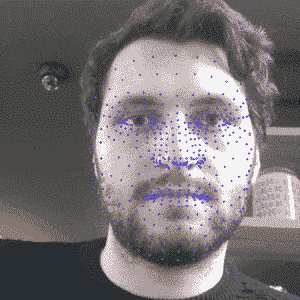

# OAK-D 深度传感人工智能相机变得更小更轻

> 原文：<https://hackaday.com/2021/10/15/oak-d-depth-sensing-ai-camera-gets-smaller-and-lighter/>

OAK-D 是一款开源的全彩色深度感应相机，具有嵌入式人工智能功能，现在有一个名为 OAK-D Lite 的更新、更轻版本的众筹活动。新型号做了以前型号可以做的一切，将机器视觉与立体深度传感相结合，并能够在板上运行高度复杂的图像处理任务，使主机摆脱任何相关的开销。

An example of [real-time feature tracking](https://github.com/luxonis/depthai-experiments/blob/f6c0d0d23e2e86a5434c65347cbe365ce0729138/gen2-facemesh/README.md#gen2-facial-landmarks-on-depthai), now in 3D thanks to integrated depth sensing.

OAK-D Lite 相机实际上是一个封装中的几个元素:一个全彩色 4K 相机，两个用于立体深度传感的灰度相机，以及带有英特尔 Movidius Myriad X 处理器的板载 AI 机器视觉处理。将这一切结合在一起的是一个名为 [DepthAI](https://docs.luxonis.com/en/latest/) 的开源软件平台，它将相机的功能和能力包装在一起，成为一个统一的整体。

目标是让嵌入式系统实时获得类似人类的视觉感知，其核心是检测事物，并识别它们在物理空间中的位置。它结合了传统的机器视觉功能(如边缘检测和透视校正)、深度感测，以及插入预训练的卷积神经网络(CNN)模型的能力，用于复杂的任务，如对象分类、姿势估计或实时手跟踪。

那么是怎么用的呢？实际上，OAK-D Lite 是一个旨在插入主机(运行任何操作系统)的 USB 设备，该团队已经做了大量工作来尽可能简化它。在可下载应用程序的帮助下，硬件可以在大约半分钟内启动并运行。在 DepthAI SDK 的帮助下，可以在 Python 中[将设备集成到其他项目或产品中，DepthAI SDK](https://docs.luxonis.com/projects/sdk/en/latest/getting_started/#cookbook)以最少的编码和配置提供功能(对于更高级的用户，还有一个用于低级访问的[完整 API](https://docs.luxonis.com/projects/api/en/latest/#welcome-to-depthai-gen2-api-documentation) )。由于视觉处理都是在板上完成的，即使是一台 Raspberry Pi Zero 也可以有效地用作主机。

还有一件事可以改善易用性，那就是对 OAK-D Lite(以及以前的 OAK-D)的支持已经添加到一个名为 [Cortic Edge Platform (CEP)](https://github.com/cortictechnology/cep#readme) 的软件套件中。CEP 是一个基于块的可视化编码系统，运行在 Raspberry Pi 上，面向任何希望在主要的可视化界面中使用 AI 工具快速构建原型的人，提供了另一种将项目粘合在一起的方法。

今年早些时候，我们看到 OAK-D 用于[一个视觉识别杂草和估计农业生物量的系统](https://hackaday.com/2021/01/31/opencv-and-depth-camera-spots-weeds/)，看到一个新模型发布令人兴奋。如果你感兴趣，OAK-D Lite 在 Kickstarter 活动期间可以以相当大的折扣[买到。](https://www.kickstarter.com/projects/opencv/opencv-ai-kit-oak-depth-camera-4k-cv-edge-object-detection/)