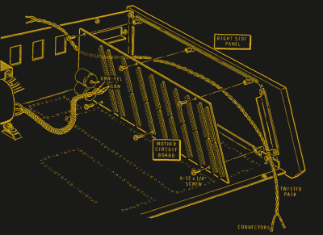
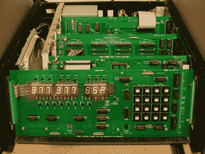
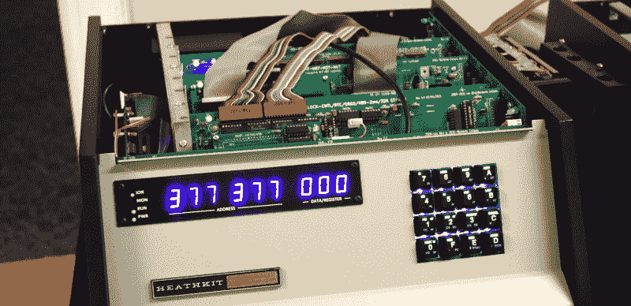
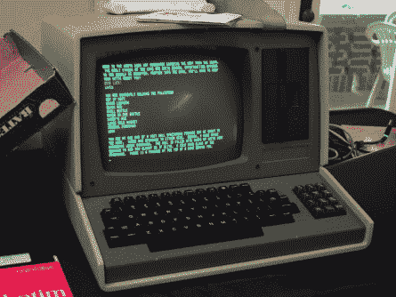
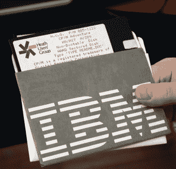

# 东 VCF 2021:保留希斯基特的 8 位计算机

> 原文：<https://hackaday.com/2021/10/27/vcf-east-2021-preserving-heathkits-8-bit-computers/>

如果说希斯基特的名字在黑客读者中家喻户晓，那就有点轻描淡写了。他们的传奇套件引发了无数的电子爱好，并最终引发了大量的职业生涯。从相对简单的无线电接收器到示波器和电视，该公司提供了从战后一直到 20 世纪 90 年代的各种技能水平的套件。

因此毫不奇怪，1977 年，看到早期家用电脑如 Altair 8800 和 IMSAI 8080 的成功，希斯基特决定用他们自己的电脑套件加入竞争。但那时，家用电脑市场已经开始从一个业余爱好者的追求转向一个全家人都可以享受的东西。与同样在 1977 年推出的苹果 II 和 TRS-80 相比，希斯基特的机器似乎是一个过去时代的产物。

虽然它可能没有获得设计来与之竞争的微型计算机的恶名，但希斯基特 H8 肯定不会被遗忘。在 2021 年东老式计算机节的一个角落里，藏着一个令人印象深刻的展览，献给八位健康计算机学家协会(SEBHC) ，名为*健康工具包:保持遗产活力*。由格伦·罗伯茨(Glenn Roberts)呈现，这一原始和现代硬件的集合展示了这群热情的 Heathkit 所有者所付出的令人难以置信的努力，他们不仅保存了这些经常被忽视的计算机的内存，还继续改进了该套件的独特设计。

## 不仅仅是克隆

虽然 Heathkit H8 可能被设计为 Altair 8800 的当代产品，并使用相同的 Intel 8080 CPU，但它绝不是 IMSAI 8080 的克隆产品。H8 没有使用 S-100 总线，这可能是当时最大的与普通微型计算机不同之处。匆忙拼凑并基于军用剩余 100 针边缘连接器，S-100 总线有许多已知的问题，因此希斯基特决定设计一种简化的 50 针背板设计，他们称之为本顿港总线。

Installing the H8’s backplane

背板安装在 H8 机箱的右侧，可以容纳十个带角度的扩展卡。第一个插槽自然被前面板硬件占用，CPU 板占用第二个插槽。在默认配置中，这为扩展目的留下了八个额外的插槽，尽管最后一个位置的卡需要缩短长度，否则它会碰到电源。

在操作上，H8 也明显不同于其竞争对手。前面板取消了 Altair 独特的二进制拨动开关和 LED，代之以八进制键盘和七段 LED 显示屏。这使得用户可以更快地输入程序和检查内存地址，尽管地址符号不太直观。也就是说，H8 实际上有一个 1 kB 的 ROM，其中包含足够的代码来引导机器进入功能状态，因此用户不需要像在早期的 S-100 微型计算机上那样每次启动时都键入加载程序。

显然，希斯基特不只是想复制竞争对手的做法。他们对微型计算机应该如何工作有一些非常有趣的想法，并对当时的实际机器进行了许多改进。但是总有改进的空间。

## 翻拍经典

自从 H8 以套件形式出现并包括完整的原理图，SEBHC 的成员已经能够创建现代复制品，进行各种调整和改进。有了社区开发的 PCB 和文档，就有可能在没有任何原始硬件的情况下创建一个功能性的 Heathkit H8。

An H8-2000, with IDE drive and ATX PSU.

取决于你使用哪一代多氯联苯，社区成员称之为 H8-2000 或 H8-2020。没有原始外壳的好处，这些机器可能最终看起来相当工业化，但美学在很大程度上取决于构建系统的人想要走多远。当然，如果你足够幸运，有一个原始的 H8(或者至少是其中的一部分)，你可以用新开发的组件和扩展来扩充它，以便两全其美。

SEBHC 的成员如 [Norberto Collado 开发了一系列令人难以置信的扩展卡](http://koyado.com/Heathkit/Welcome.html)以适应 H8，如内存升级、IDE 控制器、网络接口、支持大容量存储设备的 USB 控制器，甚至使用 Z80 的新 CPU 板。一个适当配备的 H8 有潜力成为一个逆向计算的梦想机器。

格伦将两台这样的 h8 放在桌子的正上方，以吸引路过的与会者的注意，因为即使对于外行人来说，这些计算机也是一些混合设计的结果。看到配有现代 ATX 电源和新制造的扩展板的老式外壳，观众不禁好奇。Glenn 称之为“Big Blue”的 H8-2020 受到了特别关注，它配备了令人惊叹的蓝色 LED 显示屏和发光键盘，是 70 年代简约和现代风格的华丽融合。

## 复制竞争

为了赶上像苹果和 Tandy 这样的新机器，Heathkit 很快推出了一款新的台式机，H89。它基于 Z80，将一个 12 英寸的 CRT 显示器和磁盘驱动器组合成一个单元，并以套件和预建的形式提供。最终的结果是一些看起来很像 TRS-80 模型三，而不像它之前的 H8。

亚历克斯·博德纳尔坐在格伦的桌子旁边，带着他漂亮的 H89 参加了一个展览，他称之为希斯基特 H89 上的*冒险 1.0。顾名思义，他的机器运行的是 Heath 用户组提供的原始软盘上的 CP/M 版本的 text adventure。*

    

不幸的是，希斯基特在电脑游戏中的日子屈指可数了。H89 发布后不久，该公司被 Zenith 收购，Zenith 又将 H89 更名为 Z-89，并停止了套件版本的销售。Z-89 经历了几次修改，并在市场上一直持续到 1985 年，但希斯基特的名字再也不会出现在计算机的前面板上。

## 对于新一代人来说

尽管 Heathkit 在电子爱好者中是非常知名的品牌，但相对来说很少有人熟悉他们对计算机市场的短暂涉足。几位与会者从希斯基特:保持遗产活力而来惊讶于一家他们非常熟悉的公司开发并销售了多种他们甚至从未听说过的电脑。

在 20 世纪 80 年代，希斯基特 H8 可能永远不会有机会与马修·布罗德里克演对手戏，但通过八位希斯计算机专家协会的努力，这台老式计算机似乎有望获得第二次生命。事实是，你今天可以建造一个全新的 H8，它比 1977 年的原版更强大、更可靠。因此，无论你是在寻找一个独特的电子项目，还是想探索逆向计算的世界，希斯基特可能就是你正在寻找的。