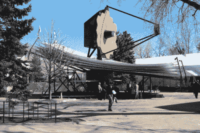

# 30 天的恐怖:发射詹姆斯·韦伯太空望远镜的后勤工作

> 原文：<https://hackaday.com/2021/11/02/30-days-of-terror-the-logistics-of-launching-the-james-webb-space-telescope/>

早在 2019 年在帕萨迪纳举行的超级大会期间，我有机会去诺斯罗普·格鲁曼公司的雷东多海滩校区参观詹姆斯·韦伯太空望远镜。在 M8 大楼里有一个 10，000+级的高开间洁净室，我和我的妻子以及我的太空迷汤姆·纳尔迪有机会参观了可能是有史以来最昂贵的单个物体。耗资 100 亿美元的太空天文台正在进行我们认为是最后的测试，然后被打包，送往位于 L2 拉格朗日点的永久家园。

遗憾的是，由于技术困难和新冠肺炎疫情，JWST 又要两年才能真正准备好出货——这不是该项目的新故事， [Mike Szczys 在 2015 年参观了同一设施](https://hackaday.com/2015/04/20/hackaday-tours-northrop-space-telescopes-and-jet-planes/)。但好消息是，它终于出货了，在太空之旅中迈出了非常非常缓慢的第一步。

这次旅行的地面部分和穿越 150 万公里太空的旅行都充满了危险，当然是不同类型的危险，但仍然有很多机会发生影响任务的事件。让我们来看看这个无价的、期待已久的天文台将会面临什么，以及它的看护者将如何忍受未来的“30 天恐怖”。

## 陆地、海洋和空中

这似乎是不言而喻的，但詹姆斯·韦伯太空望远镜很大。照片在捕捉事物的规模方面做得很差，即使当它们显示人们在工作时，也无法与站在那里看着事物的体验相比。JWST 之大是我所到过的任何其他物体都无法感受到的。它高耸在你的上方，即使在我们看到的半折叠状态下也是一个笨拙的东西。看着结构的大小和复杂性，尤其是它明显的脆弱性，任何有工程好奇心的人都会想知道他们到底要如何安全地移动那东西。

A full scale model of the James Webb Space Telescope

当然，JWST 被设计成可移动的，并适合将它送入轨道的阿丽亚娜火箭的 5.4 米整流罩内。但在整合到火箭上之前，望远镜必须折叠到定制的集装箱中。用于空中、道路和海洋的太空望远镜运输车(str asters)基本上是一个移动洁净室，旨在保持 Webb 在太空旅行中的折叠配置。

“斯塔尔斯”之前曾几次被用来运送韦伯，因为它穿梭于美国宇航局的各个设施进行测试和组装，但在 2021 年 9 月 24 日，韦伯开始了它在“斯塔尔斯”的最后一次旅程。包装好后，集装箱被装上一辆特殊的超大载重牵引拖车。凌晨时分，意志坚强的司机乔治·阿德利驾驶着这辆笨重的卡车，穿过洛杉矶的街道和高速公路，行驶了 26 英里(42 公里)，来到海军武器站海豹滩，在那里等待它下一段旅程的乘坐，货船 MN Colibri。

9 月 26 日，MN Colibri 号离开码头，向东南方向驶去，前往欧洲航天局在法属圭亚那库鲁的航天港。美国国家航空航天局的一组工程师参加了这次飞行，他们在为期 16 天的旅程中监测了飞船的健康状况，其中包括通过巴拿马运河。在到达 Kourous 后，Webb 被卡车运送到 ESA 的集成设施，在那里它被从 STTARS 打开，并被转移到另一个洁净室进行最终测试，加油，并与 Ariane 5 运载火箭集成。

 [https://www.youtube.com/embed?version=3&rel=1&showsearch=0&showinfo=1&iv_load_policy=1&fs=1&hl=en-US&autohide=2&wmode=transparent&listType=playlist&list=PLcy1hEnsejK0_ImohqEdxsB7ECXhGWaG1](https://www.youtube.com/embed?version=3&rel=1&showsearch=0&showinfo=1&iv_load_policy=1&fs=1&hl=en-US&autohide=2&wmode=transparent&listType=playlist&list=PLcy1hEnsejK0_ImohqEdxsB7ECXhGWaG1)

## 30 天的恐怖

假设测试和集成一切顺利，Webb 计划于 2021 年 12 月 18 日美国东部时间 7:20 发射。发射开始了大约一个月的航行，前往位于 L2 拉格朗日点的天文台总部，在此期间，300 个单点故障中的任何一个都可能破坏任务。就像火星登陆任务面临的[【7 分钟的恐怖】](https://hackaday.com/2021/02/08/getting-ready-for-mars-the-seven-minutes-of-terror/)一样，韦伯的陪同人员将面临 30 天的不确定性和偶尔扣人心弦的悬念。

在八分钟的太空之旅中，韦伯将经受航天飞行中常见的侮辱，并在此基础上接受了彻底的测试。大约 30 分钟后，第一个里程碑——展开天文台的太阳能电池板——将开始。这是 50 次部署中的第一次，也是关键的一步，因为望远镜需要来自这些面板的能量；船上没有其他能源。随着太阳能电池阵列的部署和测试，将部署和测试高增益天线。

大约在任务开始 12 小时后，韦伯将启动引擎，让它朝着 L2 的方向前进。三天后，沿着主镜的前侧和后侧装载的遮阳板托盘将向下折叠到它们的最终位置。一旦完成，支撑主镜的桅杆将被顶起以清理遮阳罩。即使遮阳罩在这一点上仍然是折叠的，它们仍然为太阳风提供了一个显著的表面积，所以每个托盘末端的调整片被展开来帮助调整压力。

## 升起护盾。

遮阳罩的完全展开无疑是整个过程中最粗略的部分。遮阳板由五块独立的金属化 Kapton 板组成，每块板的大小相当于三个网球场。每一个都必须展开，伸展到它的最大尺寸，拧紧，并垂直隔开，这样遮阳罩才能工作。这需要 140 个释放机构、70 个铰链、8 个展开马达、大约 400 个滑轮和近 400 米的电缆的协调动作才能完成，更不用说控制一切的传感器、线束和计算机了。完成遮阳部署需要两天的时间。

一旦遮阳板展开并拉紧，光学展开将开始，大约 10 天进入任务。这个过程从副镜开始，副镜骑在一个三角形的吊杆上，吊杆靠着主镜的中心部分折叠。这为主镜的两个侧翼让路，每个侧翼容纳 18 个六边形镀金铍镜中的三个。

许多其他步骤，如散热器部署，低温冷却器启动和系统检查也在部署期间完成，但航天器将在任务的第 14 天左右进入运行配置。当然，这是最好的情况——在韦伯到达空间站并进入环绕 L2 的光环轨道之前，任务操作员还有两周左右的时间做好一切准备。控制人员仍有一大堆工作要做，包括将仪器降低到工作温度，并仔细调整主镜。镜子的每一部分都装有伺服系统，可以使其表面轻微变形；伺服系统在诺斯罗普·格鲁曼工厂展示的样品镜部分清晰可见，整个事情是一个工程奇迹。操作员将仔细对准主镜的每个部分，以及位于主镜中心的次镜和微调镜，以形成尽可能完美的光学系统。

 [https://www.youtube.com/embed/bTxLAGchWnA?version=3&rel=1&showsearch=0&showinfo=1&iv_load_policy=1&fs=1&hl=en-US&autohide=2&wmode=transparent](https://www.youtube.com/embed/bTxLAGchWnA?version=3&rel=1&showsearch=0&showinfo=1&iv_load_policy=1&fs=1&hl=en-US&autohide=2&wmode=transparent)

从雷东多海滩到 L2 的每一步都对詹姆斯·韦伯太空望远镜的成功至关重要。任务规划者和工程师已经成功完成了最初 5800 英里(9300 公里)的旅程，没有发生任何重大事故，这一事实令人欣慰，但还有很长的路要走。我们希望韦伯的团队同样沉着地处理下一个一百万英里，这个被推迟了很久、备受期待的仪器开始兑现它对世界级科学的承诺，并一窥宇宙的起源。

【特色图片: [NASA](https://www.nasa.gov/topics/technology/features/webb-2011progress.html)