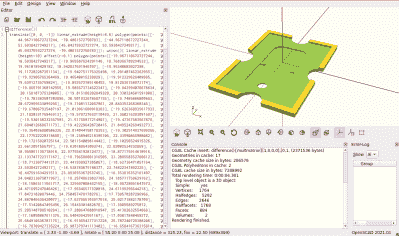

# 使用 3D 打印夹具简化您的 SMD 组装流程

> 原文：<https://hackaday.com/2021/11/09/streamline-your-smd-assembly-process-with-3d-printed-jigs/>

你的全新印刷电路板刚刚出现，这次你甚至记得订购模板。你把模板放在其中一块板上，用一只手按住它，用另一只手擦一些锡膏。模板移动了，弄得一团糟，到处都是浆糊。清洗，冲洗(当然，用一些异丙醇)，重复，希望下次会更好。

A PCB jig generated by OpenSCAD

也许是时候试试 [Stencilframer 了，这是一个由【Igor】](https://hyperglitch.com/articles/stencilframer)创建的 3D 可打印夹具生成器。这个非常有用的工具采用一套 gerbers 或 KiCad PCB 文件，并生成夹具和框架的 3D 模型，以牢固地固定电路板和相关的模板。该工具本身是一个 Python 脚本，使用 OpenSCAD 生成所有 3D 几何图形。从那以后，把夹具和框架模型放到 3D 打印机上就很简单了，然后*瞧！*–每次都是完美对齐的模板。

这是一个非常出色的剧本。任何经历过手工校准模板的挫折的人都应该抓住机会在他们的下一个版本中尝试一下。它甚至可以与[开放式回流热板](https://hackaday.com/2021/10/06/using-a-pcb-to-reflow-pcbs-take-2/)搭配使用，实现完全开源的 PCB 组装工作流程。

 [https://www.youtube.com/embed/P740pYMUSuU?version=3&rel=1&showsearch=0&showinfo=1&iv_load_policy=1&fs=1&hl=en-US&autohide=2&wmode=transparent](https://www.youtube.com/embed/P740pYMUSuU?version=3&rel=1&showsearch=0&showinfo=1&iv_load_policy=1&fs=1&hl=en-US&autohide=2&wmode=transparent)

