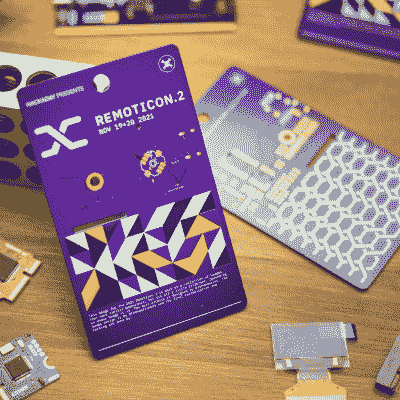

# 幕后窥视:会议徽章设计

> 原文：<https://hackaday.com/2021/11/13/peek-behind-the-curtains-conference-badge-design/>

在以前，当我们可以有亲自 Hackaday 超级计算机时，总是有徽章的问题。对于聪明但广泛的黑客来说，制造几百个小型电子设备是很棘手的。我们总是希望它能独立完成某些事情，但也希望它能有足够的自由空间，让有动力的徽章黑客能把它做得更精致。另外，有些与会者是硬件型的，有些是软件型的，还有价格限制。哦，它必须看起来不错。棘手的问题。

这里有一个极端的解决方案:第一个超级社区的徽章。面对基本上为零的预算和紧迫的时间限制，Hackaday 团队放弃了——并制作了一个原型板，但手头有大量的零件供每个人使用。和[黑客人群交付](https://hackaday.com/2015/11/20/the-best-conference-badge-hacking-youve-ever-seen/)。这个徽章展示了[如果你让所有东西都开着会发生什么](https://hackaday.com/2015/12/09/the-best-badges-of-the-supercon/)。

与 2018 年贝尔格莱德和 Supercon 徽章形成对比，除了颜色之外，它们基本上是相同的。在这里，硬件接口仅限于 9 针插头，但徽章本身是一个功能齐全的微型计算机，配有键盘和屏幕。[大多数黑客](https://hackaday.com/2018/11/06/supercon-badge-hackers-racing-the-clock/)都是用原生 BASIC 编写的，尽管有一些热心的人在玩替代的 CP/M 系统。这是[我们最软件的徽章](https://hackaday.com/2019/03/07/jaromir-sukuba-the-supercon-2018-badge-firmware/)。

我们最后一个亲自佩戴的徽章，即 2019 年 Supercon 徽章，对硬件和软件黑客都是自由的。整个事情是基于 FPGA，[与 Sprite_tm 编写的完全定制的 gateware 运行 RISC-V，但松散地基于 Z80 架构](https://hackaday.com/2020/02/19/machine-inside-of-a-chip-how-sprite_tm-built-the-fpga-game-boy-badge/)。这可能也是黑客面临的最大障碍，但你们都带着[发明的硬件插件](https://hackaday.com/2019/11/29/a-fantastic-frontier-of-fpga-flexibility-found-in-the-2019-supercon-badge/)通过了测试，还有一个团队带着定制的 Linux 操作系统在这个前所未见的虚拟环境中运行，通过硬件 SDRAM 盒式磁盘黑客实现了这一点。

最后，即使在全球供应危机之前，即使是像我们这样紧密团结的会议也可能会耗尽某一特定组件的全球供应。2016 年贝尔格莱德徽章的不为人知的故事是，Voja Antonic 买断了全球供应的 Kingbright 8×8 共阴极 LED 矩阵，并不得不在最后一刻重新设计电路板，以纳入共阳极部件。(或者反之亦然？)吸取教训，2016 super co badge[将 LED 模块换成了分立 LED](https://hackaday.com/2016/09/28/new-supercon-badge-is-40-lighter-and-a-work-of-art/)。不会缺货的红色发光二极管。

以上是对托马斯·弗卢默的非官方 Remoticon 2 徽章的长篇介绍。由于零件危机和虚拟会议，您只能靠自己来寻找徽章。像 Samson 一样，将自由与内置功能问题分开，他有两块板——一块是试验板，另一块完全填充。就像他所有的徽章一样，它们看起来都很棒。如果你下周能弄到一台由 [Remoticon](https://www.eventbrite.com/e/hackaday-remoticon-2021-tickets-172183193567?aff=talks20211104) 制造的，一定要在发布会上展示一下。如果你没有及时拿到，请亲自把它带到 2022 年的超级广场！

This article is part of the Hackaday.com newsletter, delivered every seven days for each of the last 200+ weeks. It also includes our favorite articles from the last seven days that you can see on [the web version of the newsletter](https://mailchi.mp/hackaday.com/hackaday-newsletter-649368). Want this type of article to hit your inbox every Friday morning? [You should sign up](http://eepurl.com/gTMxQf)!