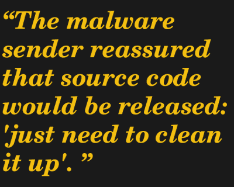
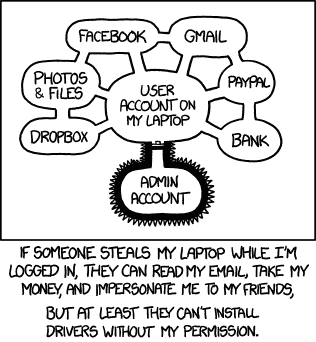
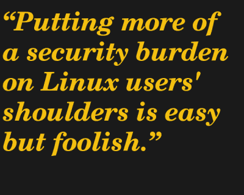
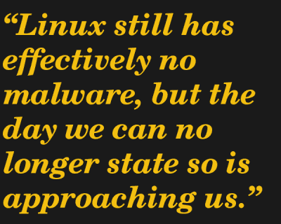

# PinePhone 恶意软件令用户惊讶，引发质疑

> 原文：<https://hackaday.com/2021/12/16/pinephone-malware-surprises-users-raises-questions/>

12 月 5 日，一个 IRC 昵称为[ubuntu]的人通过 IRC 桥加入了 Pine64 Discord 的`#pinephone`频道。本着 12 月送礼传统的精神，他们向他们的 PinePhone 用户提供了一个产品——一个“蛇”游戏。据说[ubuntu]设计的东西有潜力成为一个普通的、开箱即用的应用程序，拥有一个由粉丝、改装者和速度赛跑者组成的小而专注的社区。

不幸的是，那不会是我们生活的另一个世界，而且随着一个愉快的*“hei gaiz I make snake gaem here is link www2-pinephnoe-games-com-tz replace dash with dot kth xbai”*公告的发布，一切都不太好。令人震惊的是，这是一个木马！在 Base64 和 Bashfuscator 层之下，我们会遇到 shell 代码，它们可能出现在现代同义词词典中“ *yeet* ”一词的“示例用法”部分。

代码的恶意部分并不复杂——除了混淆，最复杂的是它是 Bash，一种内置了不可读特性的语言。由于安装包时给定的 root 权限，基于`find`的现代版`rm -rf /*`可以毫不费力地完成清理文件系统的肮脏工作，如果可能的话，预先在每个文件上运行`shred`来阻止数据恢复。至于“擦除蜂窝调制解调器的固件”的奖励部分，它利用了 [CVE-2021-31698](https://nns.ee/blog/2021/04/03/modem-rce.html) 。所有这些都将在下周三 20:00 发生，由一个`systemd`支持的 cronjob 进行调度。

[ubuntu]不共享源代码，只共享二进制文件，打包后便于在 Arch Linux 上安装。PinePhone 社区的一位杰出成员安装了该二进制程序，并享受其中的“游戏”部分，询问了让它开源的计划——从[ubuntu]那里得到保证，源代码最终会发布，“只需要清理一下”。有些人不太确定，认为人们不应该玩没有源代码回收链接的随机游戏。人们警惕性很低，在大约半天后，一个谨慎而精明的成员解开该软件包并提醒人们注意`.INSTALL`脚本中可疑的 base64 之前，可能有多达十几个安装。

# 我们如何解读这一点？

这是一次针对 PinePhone 用户的小规模但高强度的破坏性攻击，专门针对使用 Arch 的用户，*顺便提一下*。恶意软件发送者在发布之前宣布了他们的“游戏开发成果”，留在频道里做了一些闲聊和 Q & A，否则无法很快与普通开发者区分开来，他们会用自己的第一个应用程序来祝福一个潜在的平台。最重要的是，贪吃蛇游戏非常真实——不清楚代码是否可能是从一些开源项目中窃取的，但你不会将其与无恶意的贪吃蛇游戏区分开来。奇怪的是，该软件包似乎没有向任何服务器发送私人数据(或加密文件，或强迫你观看类似现代手机游戏的广告)——它很容易做到，但它没有。

随着在 PinePhone 蜂窝调制解调器逆向工程上所做的大量工作，该恶意软件利用了在这项工作中发现的 CVEs，这很奇怪。考虑到安卓世界的分裂和苹果世界的混乱，你不会期望一个典型的手机病毒能完成一个蜂窝调制解调器的砖块把戏。有趣的是，社区开发的用于 Quectel 蜂窝调制解调器的开源固件不受被利用的漏洞的影响，总体来说功能更全面，但 Pine64 由于法规合规性的原因，默认情况下需要发布可利用的专有固件——根据 Pine64 消息来源，超出范围的后果足够严重。

问题浮现在脑海里。PinePhone 是安全的平台吗？我的观点是——如果你希望在使用它时无条件安全，那么与其他任何东西相比，答案是“是”,“否”。就目前的情况来看，这是一个明确要求你理解你在指挥它做什么的平台。

有了比其他现代手机更多的操作系统发行版，你可以使用 Ubuntu Touch 来获得流畅的体验。当你使用手机时，你被赋予了更大的力量来保护自己的安全。了解这种力量潜力的人是为 PinePhone 项目做出贡献的人，这就是为什么他们在这次事件中特别成为目标是令人难过的。

其他平台以不同的方式解决这些问题，其中只有一部分解决方案是由平台完成的实际软件和架构工作，另一部分是通过培训用户。例如，你不应该在你的 iPhone 上使用第三方应用商店(或固件，或充电器，或握持方式)，Android 有开发者模式复选框，如果你在设置屏幕上用手指重现[“大黄蜂的飞行”](https://www.youtube.com/watch?v=aYAJopwEYv8)的第三个动作，你就可以找到它。Linux 生态系统的方式是依靠内核来提供可靠的底层安全原语，但是责任在于发行版来整合利用这些原语的软件和配置。

我认为移动 Linux 发行版也应该定义和维护它们在“安全”尺度上的地位，详细说明它们在涉及第三方应用时采取的措施。半年前，当我准备一份关于可用于 PinePhone 的不同操作系统及其在应用程序安全性上的立场的总结时，我花了比让某人花在如此重要的任务上更长的时间。

# 我们有什么选择？

给新人的建议要点是“不要安装你不信任的随机软件”。虽然这本身是一个好建议，但你指出这一点是对的——一款游戏不应该破坏你的系统，而且“获得更好的用户”通常不是一个可行的策略。任何否认人类固有易犯错误的安全策略师在现代社会都是行不通的，所以让我们看看除了通常的“教育用户”部分之外，我们还能做些什么。像往常一样，有一个 XKCD 开始。

即使能够在 Linux 系统上写入任意用户拥有的文件，也是“游戏结束”。比如说，在`$HOME/.bashrc`中，你可以将`sudo`别名为`stdin-recording-app sudo`和[，下次它们在终端](http://turbochaos.blogspot.com/2013/11/ghetto-privilege-escalation-with-bashrc.html)中运行`sudo`时获取用户的密码。`.bashrc`也不是唯一一个被定期执行的用户可写文件。虽然正在开发沙箱解决方案来解决这类问题，但这项工作很慢，而且它的各个方面都很重要，通常最好描述为“动态和复杂的白名单”。

一个普遍给出的建议是“如果你不能阅读代码并理解它做什么，就不要运行它”，这大概适用于比周末项目更长的包和代码库。具有讽刺意味的是，这使得 Linux 与闭源系统相比处于不必要的劣势。“分享一个。exe”的分发应用程序的方式[比我个人的方式](https://en.wikipedia.org/wiki/DOS_MZ_executable)还要古老，它仍然是一种被接受的分享某人为 Windows 编写的软件的方式，UAC 已经成为另一个反射性的点击链接盒子。再说一次，让 Linux 用户承担更多的安全负担很容易，但却很愚蠢。

在恶意软件的情况下，共享源代码会有帮助吗？不要！事实上，附加一个源代码回购的链接将有助于[ubuntu]使恶意软件的传播更加可信。当你发布一个包时，即使是在信誉良好的平台上，也很少会检查你上传的包中的代码是否与你的回购中的代码相匹配。

很多地方都是如此——GitHub 和 [GitLab](https://git.ispconfig.org/ispconfig/ispconfig3/-/issues/6222) 发布版、 [DockerHub](https://slsa.dev/example) 、NPM、 [RubyGems](https://snyk.io/blog/malicious-remote-code-execution-backdoor-discovered-in-the-popular-bootstrap-sass-ruby-gem/) 、浏览器扩展商店、 [PyPi](https://stackoverflow.com/questions/46270513/verifying-the-integrity-of-pypi-python-packages) ，甚至一些本应安全的 Linux 库、[如 F-droid](https://forum.f-droid.org/t/source-tarball-may-not-contain-all-the-source-code-srclibs/15360) ，都容易受到攻击。随着恶意软件包提供源代码增加了合法性，并从一开始就剥夺了技术人员检查二进制文件的动机——嘿，代码已经在那里了！如果[ubuntu]真的这么做了，也许我们会在几天后以更严肃的语气谈论这件事。供应链攻击是 2020 年和 2021 年的新热点。

我们建立的许多安全系统都是基于信任的。包签名是最突出的一种，其中负责维护包的人的加密签名用于建立“某人 X 保证该包无害”。HTTPS 是我们日常使用的另一种基于信任的技术，但是，实际上，[你比任何特定的密钥所有者更信任你的浏览器或操作系统的密钥库维护者](https://freedom-to-tinker.com/2010/02/16/mozilla-debates-whether-trust-chinese-ca/)。

当强制执行到实际上使我们更加安全的程度时，基于信任的技术给不具备合理的社交和加密能力的新开发人员带来了负担。然而，当经常遇到缺乏文档、不完整的 API 和未经测试的库时，我们真的应该进一步增加负担吗？也许这没那么糟。

我提到的基于信任的签名技术经常应用于你通常下载来引导你的 PC(或手机)的操作系统映像。)安装了 Linux，但它在 PinePhone 上还不流行——例如，相当多的 PinePhone 操作系统映像没有这样的签名，这让我很失望，因为大多数 PC 的主要发行版都提供了这些，我预计 Linux phone 空间也不会有什么不同，[没有签名可能是灾难性的](https://hackaday.com/2016/02/22/linux-mint-hacked-briefly-bad-isos-compromised-forum/)。有相当多的与安全相关的特性是现成的，但是没有被使用，因为如果项目的基础设施从一开始就没有考虑到安全问题，那么它们就需要很大的努力来适应项目的基础设施，或者给开发人员带来额外的负担。

# 我们真正需要的是什么？

PinePhone 社区已经实施了一些新的规则，其中一些进入了“自动化”领域。这可能有助于某种特定的问题在未来不那么具有影响力——尽管我认为机构记忆应该在这方面发挥更大的作用。小心希腊人带礼物…直到他们学会如何绕过你的不和谐机器人的启发？例如，我已经有了。这是一个不朽的话题，其根源超越了 2021 年的大型 PinePhone Snake 恶意软件，而本文与其说是关于这一点，不如说是关于帮助您理解 Linux 安全的重要方面，或者甚至是所有开源软件的安全。

对我来说，这个恶意软件击中了“不可避免”和“过程调整”和“成长的烦恼”的音符。关于信任和软件的讨论在每个足够大的社区都会发生。

我们需要承认 Linux 恶意软件是可能的，并且可能最终变得广泛传播，关于如何阻止它的健康讨论是至关重要的。Linux 实际上仍然没有恶意软件，但是我们不能再这样说的那一天正在向我们逼近。

我不确定我们需要的确切航向调整。理解系统大有帮助，但是我们期望的安全措施不能排除高级用户和初级开发人员。从技术上来说，无论是容器化、沙箱、基于信任的基础设施，还是内存安全的语言，我们都需要知道自己需要什么，然后才知道要什么。

感谢 Pine64 社区[【Lukasz】](https://twitter.com/LukaszErecinsk1)和[【黑客奇侠】](https://twitter.com/hackerfantastic)对 PinePhone 情况实况调查的帮助。