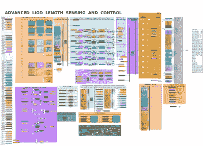

# 主题视频:基思·索恩博士解释了 LIGO 硬件的极端工程

> 原文：<https://hackaday.com/2021/12/09/keynote-video-dr-keith-thorne-explains-the-extreme-engineering-of-the-ligo-hardware/>

激光干涉引力波观测站(LIGO)是一个以千米为单位的巨大装置，它在监听时空的褶皱。实现这一点是一个硬件和软件黑客的真实故事，我们很幸运地邀请到基思·索恩博士在 2021 年黑客日远程会议上通过[他最新发布的“极端天体物理学的极端仪器”主题演讲](https://www.youtube.com/watch?v=df90XA_XQs0)深入探讨这些细节。

重力导致时空拉伸——回想一下你见过的图表，一个巨大的球体(恒星或行星)坐落在一个画有网格线的平面上，平面的结构从球体的质量向下拉伸。如果你有两个像黑洞一样的大质量实体，它们会发出引力波。当它们碰撞融合时，会产生一系列短暂但非常强烈的波。LIGO 正在寻找这些事件的证据。

大约在 1967 年，莱维斯有了用激光干涉仪寻找引力波的想法，但当时可用的激光技术太新，无法完成这项壮举。在干涉仪中，激光穿过分束器，一束光反射出去并返回一段距离，然后使用光电探测器测量光的强度，与另一半光重新组合。当长腿的距离改变时，激光的相对相位移动，检测到的功率也将变化。

LIGO 不是你的台式干涉仪。它使用 5 千瓦的激光输入。干涉仪的 4 公里分支将光来回反射 1000 次，有效传播距离为 4000 公里。这些支架保持在极端真空下，镜子保持异常静止。值得；这台仪器可以以万分之一的精度测量一个质子的直径！

## 让 LIGO 成为可能的黑客

Keith 说“没有一家 ACME Interferometer 公司可供你订购”。这是一件经常被忽视的事情:做硬科学通常意味着新仪器的出现。虽然激光干涉术的主题早在 LIGO 开始之前就已经存在，但它的精确度在人类建造的任何东西中从未出现过。

该团队正在使用现成的计算机，但传统的操作系统缺乏快速读取光电探测器值所需的实时访问。黑客是利用多核 CPU，但专门用一个核心来读取数据。这是通过定制 Linux 内核来完成的。

MATLAB graphical flow for configuring LIGO

一旦你有了这样一个系统，无数的研究人员会想用它来进行他们自己的研究。该团队知道许多科学家已经在使用 MATLAB。LIGO 的用户界面黑客是写一个配置系统的 MATLAB Simulink 插件。现在，研究人员可以在机器上使用图形界面直接控制硬件。

为了消除电子控制系统的噪音，进行了大量的故障排除工作。一个巧妙的细节是，他们利用双音振荡器设置(960 Hz 和 961 Hz)来产生每秒 1 个脉冲的计时系统。但还有更有趣的细节，比如需要移除数字化仪附近的 LED 状态灯，因为它们闪烁时会产生干扰。

机械工程黑客相当疯狂。激光束如此强大，以至于需要一个物理屏障来防止它烧穿精密的设备。他们建造了一个高速物理快门，可以在光束路径中砰的一声到位，确保你不会烧毁你的设备。

## 从内部看绝对不可思议的设备

我们非常感谢 Keith 在 Remoticon 发表这个演讲。LIGO 站在天体物理学的最前沿，即使是我们中最古怪的人也只是对正在做的工作有初步的了解。下面他的深思熟虑的介绍是一种享受，我们希望它能帮助我们睁开眼睛，看到所有有趣的工作，以及以科学的名义每天进行的非常聪明的黑客行为。

 [https://www.youtube.com/embed/df90XA_XQs0?version=3&rel=1&showsearch=0&showinfo=1&iv_load_policy=1&fs=1&hl=en-US&autohide=2&wmode=transparent](https://www.youtube.com/embed/df90XA_XQs0?version=3&rel=1&showsearch=0&showinfo=1&iv_load_policy=1&fs=1&hl=en-US&autohide=2&wmode=transparent)

### 资源:

*   [本次演讲的幻灯片](https://drive.google.com/file/d/1m9FR-BrTPDD0pXGAF6rfnR2qkW6Oyrtn/view?usp=sharing) (PDF)
*   [LIGO 代码库](https://git.ligo.org/explore/projects/starred)