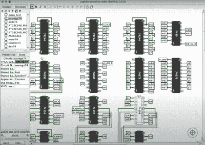

# 一台记录良好的试验板计算机显示了奉献精神

> 原文：<https://hackaday.com/2021/12/18/a-well-documented-breadboard-computer-shows-dedication/>

这些页面并非完全没有自制的计算机，那些构建在无焊试验板上的计算机不太常见，但仍不罕见。但更罕见的是这款全新的 [8 位 74xx 逻辑计算机](https://www.youtube.com/watch?v=vaGZapAGvwM)(视频，嵌入下方)，配有完整的源代码、仿真器、汇编器和测试套件。[JDH]花了整整两个星期的时间工作到深夜来建造这个，结果不言而喻。

> 新的 JDH-8 现在是现实的虚构。

该架构是传统的 8 位加载/存储微代码处理器，微代码存储在易于编程的 AT28C64 EEPROMs 中，以便于调整。地址总线是 16 位的，这对于它来说已经足够了，并使它符合(公认的更复杂的)老的 8 位微处理器，如 6502。还有一个硬件堆栈和一个离散逻辑 ALU！最后，由于这还不够，他添加了自己的分立逻辑视频控制器。

Wise people simulate before prototyping something like this

有 16 条指令涵盖内存访问、ALU 操作和 I/O 操作。这个项目的一个伟大之处在于[JDH]欣然承认了在这个过程中所犯的错误，以及架构本不需要如此复杂。一个例子是，硬件堆栈并不是真正必要的，因为它可以在软件中实现。此外，由于实现的原因，与可实现的周期时间相比，内存访问是如此之快，以至于根本没有必要使用加载/存储架构！尽管如此，[JDH]还是享受了构建和编程的乐趣！

有趣的是看到使用 LogiSim-Evolution 首先调试架构的高级模型，然后翻译成 TTL 芯片。这个抄写员不知道这个工具(可耻！)但是很快就会尝试这种方法。

软件方面的所有代码都可以在 GitHub 项目中找到。也许硬件设计也会出现在那里，只是在我写这篇文章的时候，我们似乎找不到它。

无法获得足够的试验板计算机？看看去年的这个。为你最新的面包面包*板*电脑找一个合适的外壳？[来个面包*箱柜*怎么样。](https://hackaday.com/2021/10/05/breadbin-is-an-8-bit-ttl-cpu-on-a-breadboard-in-a-bread-bin/)

 [https://www.youtube.com/embed/vaGZapAGvwM?version=3&rel=1&showsearch=0&showinfo=1&iv_load_policy=1&fs=1&hl=en-US&autohide=2&wmode=transparent](https://www.youtube.com/embed/vaGZapAGvwM?version=3&rel=1&showsearch=0&showinfo=1&iv_load_policy=1&fs=1&hl=en-US&autohide=2&wmode=transparent)

感谢[BrightBlueJim]发送此邮件！