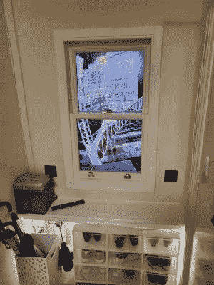

# “世界之窗”将远方带进你的家

> 原文：<https://hackaday.com/2021/12/20/window-to-the-world-brings-far-off-places-to-your-home/>

对于那些喜欢环游世界的人来说，过去两年的生活并不美好。世界范围内的封锁和旅行限制让许多人被困在自己家里，而他们宁愿乘飞机去遥远的城市。如果你是那些被旅行癖困扰的人之一，亚历克斯·莎翁可能会给你一个解决方案:一个展示来自世界另一个地方的实时图像的 T2 窗口。

The Window, showing a live feed from Tokyo.

为了让这种体验尽可能逼真，[亚历克斯]在他伦敦的家中使用了一扇真正的窗户，并在窗户后面安装了一台大型电视。一幅挂在墙上的地图使他能够通过在地图上移动一个小小的磁性平面来选择五个地点中的任何一个。发光二极管显示可用的点，而磁力计检测飞机的运动。然后，ESP8266 指示媒体服务器连接到适当的直播流，该直播流随后显示在电视屏幕上。

所有这些已经足够聪明了，但[Alex]决定更进一步，增加一个热传感器，它可以检测任何站在显示器附近的人的位置，并在他们移动时稍微移动图像。这模拟了从一个真实的窗口向外看的视角，应该比单纯的静态图像更逼真。

整个设计可以在[Alex]的 GitHub 页面上找到，任何想眺望异国情调的人都可以复制。相反，如果你想要一种方式来回忆你过去去过的地方，看看这个很酷的纪念地球仪。几年前，我们也看到了基于谷歌地图的[。](https://hackaday.com/2014/01/22/interactive-globe-is-awesome-for-google-earth/)

 [https://www.youtube.com/embed/sXxcPxjwLj8?version=3&rel=1&showsearch=0&showinfo=1&iv_load_policy=1&fs=1&hl=en-US&autohide=2&wmode=transparent](https://www.youtube.com/embed/sXxcPxjwLj8?version=3&rel=1&showsearch=0&showinfo=1&iv_load_policy=1&fs=1&hl=en-US&autohide=2&wmode=transparent)

感谢[Itay]的提示。