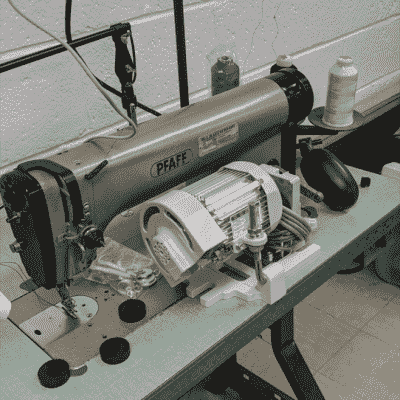

# 简单的升级让一台旧的工业缝纫机焕然一新

> 原文：<https://hackaday.com/2021/12/23/simple-upgrades-make-an-old-industrial-sewing-machine-new-again/>

嗯，这是一个惊喜:似乎工业设计师[埃里克·斯特雷贝尔]最近得到了一台工业缝纫机，以解决原型制作中较软的一面。让我们不惊讶的是[他做了一些升级，让它更人性化](https://www.youtube.com/watch?v=7xf7v8GM738)。在下面嵌入的视频中查看它们。

那么，像这样的机器和你家里可能有的有什么区别呢？家用缝纫机有一个拳头大小的电机，它在机器的体内。现代家仆可以做轻活，但他们不会做包和室内装潢，也不会把一层一层的材料缝在一起。工业机器的离合器或伺服电机的尺寸是家用电机的五倍，与机器一起放在桌子上。

 【埃里克】在 Craigslist 上找到了这个普法夫 463。它建于 1950 年左右，只做一件事——单针、直缝、顺缝或反缝——但它几乎可以做任何你想做的事(不像现在那些家用的电脑化塑料)。同样，这些机器总是放在桌子里，还配有一盏灯。虽然机器本身可能是一个工作狂，但灯很弱，所以[Eric]用鹅颈 LED 灯取代了它，它有一个磁铁，可以把它贴在机器周围需要光线的任何地方。

无论大小，电动缝纫机都是用脚踏板驱动的。家用的脚踏板是松的，你可以把它放在地板上任何你想放的地方，但是工业用的脚踏板是装在桌子框架里的。[Eric]在踏板侧面钻了一些新孔，这样他就可以将连杆移近支点。这让他用更少的步法获得更好的控制。

最大、最糟糕的升级是发动机。虽然最初的离合器马达没有任何问题，但它让机器运转得非常快，以便服装工人能够完成他们的配额。正因为如此，很难控制。他升级到无刷 DC 伺服电机，以获得更高的精度和更容易的原型制作。他也很幸运，因为它直接安装在旧洞里。

我们完全同意[Eric]对旧缝纫机或任何旧机器的看法。它们往往被过度建造，因为有计划的淘汰还不是一件事。如果你买不起或找不到工业产品，一个老歌手或类似的东西可能会为你的目的服务，只要你使用正确的针。

如果你已经有一台旧的家用机器，你可以用 3D 打印机给它注入新的生命。

 [https://www.youtube.com/embed/7xf7v8GM738?version=3&rel=1&showsearch=0&showinfo=1&iv_load_policy=1&fs=1&hl=en-US&autohide=2&wmode=transparent](https://www.youtube.com/embed/7xf7v8GM738?version=3&rel=1&showsearch=0&showinfo=1&iv_load_policy=1&fs=1&hl=en-US&autohide=2&wmode=transparent)

