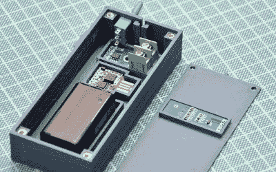

# 制作你自己的高温烤箱温度计

> 原文：<https://hackaday.com/2021/12/29/build-your-own-high-temp-oven-thermometer/>

为了密切关注他的木材燃烧披萨烤箱内的温度，[Giovanni Bernardo]决定跳过商业产品，使用 K 型热电偶制作自己的高温温度计。最终结果是一个真正的手持设备，部件数量惊人地少，至少在理论上，可以读取高达 1023.75 摄氏度的温度，尽管我们希望他会在那之前很久就把披萨拿出来。

 在 3D 打印的箱子里面我们找到的只是少数几个部件。安装在前面板上的 0.91 英寸有机发光二极管显示器连接到 Digispark ATtiny85 开发板，该开发板又连接到 MAX6675 分线板。它从热电偶探头获取输入，并将其转换为数字信号，然后利用 Adafruit 的 Arduino 库通过 SPI 读取。由于 Digispark 内置了 5 V 稳压器，因此[Giovanni]使用标准的 9 V 电池来运行这款温度计，而不是增加充电包的复杂性。

我们尤其欣赏[Giovanni]在表壳设计中对细节的关注。每一个组件都被安置在盒子底部一个完美成型的口袋里，[他甚至还为前面板的螺丝孔使用了热固插件](https://hackaday.com/2019/02/28/threading-3d-printed-parts-how-to-use-heat-set-inserts/)。如果只是做一个基本的盒子模型，然后用热胶水把他的组件粘在合适的位置上，会更快更容易，但是他绕了一大圈，我们尊重这一点。

这个项目是我们多年来观察到的一个有趣原理的另一个例子。简而言之，如果有人[费了这么大劲去检查一个物体的温度](https://hackaday.com/2019/09/04/open-source-smart-smoker-brings-the-heat-slowly/)，那么他们打算在某个时间点吃掉它的[几率就会高于平均水平。](https://hackaday.com/2020/07/27/smoking-meat-with-a-commodore-64/)