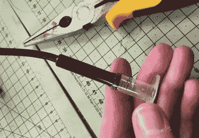

# 以低廉的价格建造一个支持 WiFi 的鸟箱

> 原文：<https://hackaday.com/2022/01/05/building-a-wifi-enabled-bird-box-on-the-cheap/>

[Jude]正在为他和他的儿子寻找一个有趣的 DIY 项目，并认为一个[鸟盒可能是一个不错的选择](https://www.instructables.com/Make-a-WiFi-Camera-Bird-Box-Cheepy-Cheap/)。他想在盒子上安装一个 WiFi 摄像头，这样他就可以用手机观察他的小客人了，但是他没有找到任何合适的、便宜的、商业上可用的选项。因此，他自己造了一个。

然而，他确实从一个普通的鸟盒子开始，这是他在网上买的，然后用他感兴趣的特殊功能进行了修改。他希望这个项目是可扩展的，这样课后项目和其他儿童俱乐部就可以很容易地在教室环境中实现他的设计。他认为尽量减少木制品会让孩子们更容易完成这个项目。

他在网上购买的普通鸟盒上加了一个销钉，但提醒读者需要调查销钉是否会吸引他们所在地区的入侵物种。他发现了一种相对便宜的支持 WiFi 的内窥镜，他指出这种内窥镜比他之前发现的配备摄像头的商用鸟箱要便宜得多。他巧妙地用一个塑料注射器作为一个防水的间谍洞，里面放着内窥镜，让他可以轻松地将相机放入和取出鸟箱，而不会打扰到里面的人。他指出，3 毫升的注射器有完美的内径，可以非常贴合地安装内窥镜。

 【裘德】不打算让内窥镜 24/7 活动，所以他需要一种方法在摄像机不使用时密封出入孔。他在戴森的多年经验告诉他，实现可拆卸的防水橡胶密封并不像人们想象的那么容易。幸运的是，注射器活塞顶端的橡胶塞天生就是一个完美的可拆卸密封，当内窥镜不用时，他可以用它来堵塞通道孔。

除了 WiFi 发射器，内窥镜大部分都是防水的，所以[Jude]需要将设备的那一端放在防水外壳中。他说，这些通常被称为“IP 额定”外壳，他认为这些可以在任何数量的户外电子项目中派上用场，所以我们想象这对我们的许多读者也可能派上用场。

自然之母无疑激发了 Hackaday 的许多项目，【Jude】的 bird box 也不例外。很酷的项目！