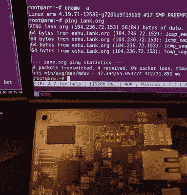

# 另一个自制 Linux 主板的成功故事

> 原文：<https://hackaday.com/2022/01/03/another-homebrew-linux-board-success-story/>

业余爱好者现在的能力真的令人难以置信。虽然这在几年前看起来几乎是不可能的，但我们很高兴地报告，又一个专门的硬件黑客已经成功地启动了他们自己的定制 Linux 单板计算机。创造者[Ian Kilgore]告诉我们，开发猫粮(是的，就是这个名字)的唯一目标是获得在家生产纸板的信心，所以在我们看来这是成功的。

 对于那些一直关注这类事情的人来说，听到【伊恩】受到【杰伊·卡尔森】的工作的启发可能不会感到惊讶，当[他把一群自制的 Linux 板](https://hackaday.com/2020/10/20/thinking-about-creating-a-raspberry-pi-replacement/)放在一起，试图比较不同的系统级封装 IC 时，他可以说是开创了整个趋势。他令人难以置信地详细记录了一路上的经验和教训，鼓励了其他勇敢的人接受挑战。

USB-C 供电板使用 ARM i.MX 6ULL 处理器，具有 DDR3、NAND 闪存和以太网接口。最后一个是与参考设计最大的偏差，这意味着它需要一点小改动才能正确。对于任何在家一起玩的人来说，[Ian]收集了在开发猫粮时学到的经验，使整个学习经历完整循环。

如果你对更多自制 Linux SBCs 感兴趣，我们[强烈推荐阅读由【Walker】](https://hackaday.com/2021/11/02/tiny-open-hardware-linux-sbc-hides-in-plain-sight/)开发的 WiFiWart。在大约六个月的时间里，我们在[见证了开放式硬件板从概念](https://hackaday.com/2021/05/06/putting-an-ultra-tiny-linux-board-in-a-phone-charger-eventually/)到小型的第一个原型。