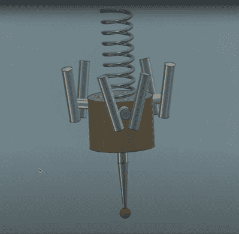

# 用基本工具制作的简单接触式探针

> 原文：<https://hackaday.com/2022/01/05/a-simple-touch-probe-made-with-basic-tools/>

Six points of contact detect any displacement.

LinuxCNC 贡献者和加工爱好者[安迪·皮尤]当然不害怕尝试制作专门的工具来看看它们的效果如何，这一次他一直在忙着[制作触摸探针](https://www.youtube.com/watch?v=2ia1_NKQJKs)(视频，嵌入在下面)，用于检查加工操作和一般测量应用的精度。

这些东西并不便宜，因为它们本质上“只是”一个带有长探针的开关，但是，就像任何专业的和以严格公差加工的东西一样，你可以理解它们为什么要这么贵。

在检查并花了一些时间对这样一个单元进行逆向工程后，[Andy]接着抓起他放在周围的一些 PEEK 棒，把它扔进车床(明白吗？).他指出，对于那些希望复制这种材料的人来说，Delrin 更具成本效益，但只要你有能力加工它，而且它不导电，还有许多其他选择可以尝试。

除了一个夹头块(就像[这个](https://www.arceurotrade.co.uk/Catalogue/Collets/ER-Collet-Fixtures/ER32-Collet-Blocks))之外，没有使用任何特殊工具，所有成角度的孔和槽都是在一个专门为老虎钳 3D 打印的支架的帮助下轻松制作的。我们认为，这是一个很好的、简单的方法！

[Andy]测试了安装在他的 CNC 转换的 Holbrook 车床上的探针的可重复性，报告值为 1 um，这似乎相当不错。探针尖端在探针体内的中心位置有点偏离，正如您所期望的那样，实际上是手工制作的，但这并不像看起来那样是个问题，因为它会导致一个固定的偏移，可以在软件中进行补偿。也许下一个版本会有一些手动拨出的可调性？

整个组件由两个塑料部件、一把研磨硬化钢销和一个大弹簧组成。唯一有点特别的是现成的探针头。在电气连接过程中，您可能会注意到使用了一种[自熔性 verowire 笔](https://verotl.com/verowire-wiring-pen-part-number-79-1732)，这是这位抄写员不知道的东西，并且已经下了订单！

设计的参考 3D 模型是从[【Andy】的 Autodesk Drive](https://myhub.autodesk360.com/ue29f55be1/g/shares/SH35dfcQT936092f0e438a96bc58ea9ac926) 中共享的，供您观赏。

当然，这不是我们看到的第一个 DIY 触摸探针，[这里有一个例子](https://hackaday.com/2011/06/09/diy-cnc-touch-probe/)，在 Hackaday 上。木卫一，这里有一个尝试，使一个[使用压电传感器](https://hackaday.io/project/9193-piezoelectric-cnc-touch-probe)。

 [https://www.youtube.com/embed/2ia1_NKQJKs?version=3&rel=1&showsearch=0&showinfo=1&iv_load_policy=1&fs=1&hl=en-US&autohide=2&wmode=transparent](https://www.youtube.com/embed/2ia1_NKQJKs?version=3&rel=1&showsearch=0&showinfo=1&iv_load_policy=1&fs=1&hl=en-US&autohide=2&wmode=transparent)

