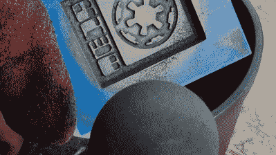

# 用于铸造 Rose 金属的 3D 打印模具

> 原文：<https://hackaday.com/2022/03/17/3d-printed-molds-for-casting-roses-metal/>

你玩过罗斯的金属吗？这是一种铋、铅和锡的易熔合金，熔点约为 100 摄氏度。历史上，它被用作铸铁栏杆和其他东西的焊料，以及可延展的管道填充材料，以防止管道弯曲时发生卷曲。

 【本希利】一直在摆弄罗斯的金属和一些 PETG 打印的模具，[制作从星球大战帝国演职员表到棋子到皮革冲压工具](https://www.youtube.com/watch?v=4rss1WjATks)的一切。在休息后的视频中，[Ben]带我们经历了这个过程，从 STLs 的模具制作开始——这是他从另一个 YouTuber 上学来的。

他建议在多部件模具上添加对准标记，以便保持所有部件对齐，并在接缝处添加一个小凹槽，以便用平头螺丝刀轻松分离。到目前为止，模具已经承受了多次灌注，尽管[本]确实打印了相当厚的模具，并且很高兴他这样做了。

至于制造液态金属，[本]使用了一个带有方便倒出口的铸铁罐和一个喷灯。他在模具中加入石墨粉，试图让他们更容易放弃货物。为了完成这些作品，[本]用锡剪切割防水板，并用砂纸和 Dremel 磨平边缘。镀铜没有成功，但[本]将再次尝试，因为他认为他在这个过程中搞砸了一些事情。他还将尝试用 TPU 打印，我们正要推荐这种灵活性。

有许多方法可以(相对)便宜地铸造金属。[你考虑过动能沙吗？](https://hackaday.com/2014/08/12/and-so-castings-made-of-kinetic-sand-turn-out-pretty-well-actually/)

 [https://www.youtube.com/embed/4rss1WjATks?version=3&rel=1&showsearch=0&showinfo=1&iv_load_policy=1&fs=1&hl=en-US&autohide=2&wmode=transparent](https://www.youtube.com/embed/4rss1WjATks?version=3&rel=1&showsearch=0&showinfo=1&iv_load_policy=1&fs=1&hl=en-US&autohide=2&wmode=transparent)

