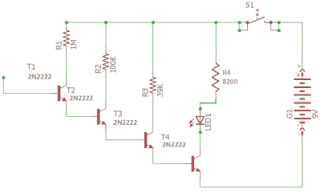
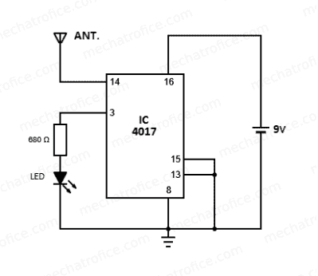

# 一个简单的电动势检测器和验电器，你可以用垃圾箱里的零件做出来

> 原文：<https://hackaday.com/2022/01/10/a-simple-emf-detector-and-electroscope-you-can-make-from-junk-box-parts/>

2N2222 devices used, but practically any junkbox NPN will do

电磁场无处不在，就在我们周围。有些是自然产生的，但在绝大多数情况下，是我们人类通过人工电子手段产生的。从你的手机到烤面包机，任何东西都会发出某种信号，不管是有意还是无意。因此，我们认为，对于一般的电子类黑客来说，用某种方式来寻找这些信号是合适的，所以这里是[Mirko Pavleski]带着他的一对非常简单的仪器来检测静态和动态电磁场。

CMOS clock input connected directly to the antenna. Warning! ESD damage risk!

第一个单元(一个简单的[验电器](https://en.wikipedia.org/wiki/Electroscope))使用 2N2222 NPN 双极晶体管的级联，配置为提供高电流增益，因此天线附近的任何电荷都会导致后续阶段的电流增加，最终点亮 LED。简单的东西。

第二个单元依赖于老派 [CMOS 4017 十进制计数器](https://www.ti.com/lit/ds/symlink/cd4017b.pdf)的极高输入阻抗，很可能达到 100mω甚至更高。通常情况下，不会让这种 CMOS 输入悬空，甚至不会用太长的 PCB 走线连接它，以免拾取杂散信号，但对于检测交变电磁场来说，这似乎很好。配置为简单的十分频，当提供 50 Hz 交流电时，可以看到 LED 以 5 Hz 的频率闪烁。

简单的东西，这个抄写员有所有这些确切的部分在垃圾箱里，所以很快就会构建这些！

我们已经研究验电器很多年了，下面是一个著名的经典实验的[现代版，以及一些](https://hackaday.com/2021/10/01/drone-replaces-kite-in-recreation-of-famous-atmospheric-electricity-experiment/)[令人毛发竖起的实验](https://hackaday.com/2018/06/13/hair-raising-tales-of-electrostatic-generators/)让你开始。

 [https://www.youtube.com/embed/KjVoekFoSa8?version=3&rel=1&showsearch=0&showinfo=1&iv_load_policy=1&fs=1&hl=en-US&autohide=2&start=562&wmode=transparent](https://www.youtube.com/embed/KjVoekFoSa8?version=3&rel=1&showsearch=0&showinfo=1&iv_load_policy=1&fs=1&hl=en-US&autohide=2&start=562&wmode=transparent)

