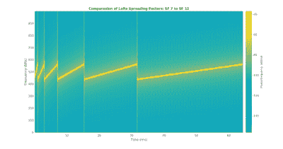
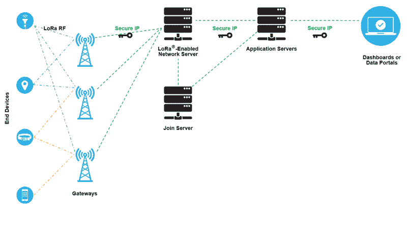
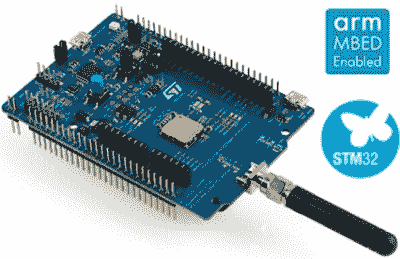

# 漫不经心地叽叽喳喳进入劳拉万的世界

> 原文：<https://hackaday.com/2022/01/21/casually-chirping-into-the-world-of-lorawan/>

虽然无线通信在项目中毫无疑问是有用的，但 WiFi 和蓝牙等常见无线协议仅在几米后就消失了，当您的项目安装在偏僻的地方时，这是很烦人的。转移到基于 LTE 或类似的移动解决方案可以帮助扩大覆盖范围，但这在蜂窝覆盖较差的情况下没有帮助，而且往往会消耗更多的电力。幸运的是，对于低比特率、低功耗的广域网(LPWAN)，例如传感器网络，有一种常见的解决方案，即 LoRaWAN，如 lo ng- ra nge 广域网(WAN)。

作为 LoRaWAN 基础的专有 [LoRa](https://en.wikipedia.org/wiki/LoRa) 射频调制技术是基于啁啾扩频( [CSS](https://en.wikipedia.org/wiki/Chirp_spread_spectrum) )。这种调制技术对信道噪声和衰落以及多普勒频移具有很强的抵抗力，使其能够使用相对较低的功率进行长距离传输。LoRaWAN 建立在由 LoRa 提供的物理层之上，然后创建设备可以用来与其他 LoRa 设备通信的协议。

多亏了全球 LoRaWAN 网关和软件提供商，如 *The Things Industries* 和 *ThingSpeak* ，即使作为一个业余爱好者，也有可能以最低的成本建立一个 LoRaWAN 供电的传感器网络。让我们来看看设置 LoRaWAN 设备到底涉及到什么，以及可以考虑哪些可能的 LoRaWAN 替代方案。

## 没有免费的射频午餐

在为项目选择合适的无线通信协议时，必须记住要选择以下任意两种:高带宽、长距离、长电池寿命。例如，在 5G 毫米波上加速千兆字节大小的传输时，智能手机消耗电池的速度惊人，而 Zigbee 只能达到微不足道的 250 kb/s，但可以在硬币电池上运行几个月，或永远使用能量收集。

LoRa spreading factor comparison (Credit: [Sakshama Ghoslya](https://www.sghoslya.com/p/lora-is-chirp-spread-spectrum.html))

LoRaWAN 的[最佳情况数据吞吐率](https://www.researchgate.net/publication/312627168_Understanding_the_limits_of_LoRaWAN) (Adelantado 等人，2017 年)为每秒几十千比特，具体取决于扩频因子(SF)。在这里，SF 本质上是发送信号发送速度的比率:更高的 SF(高达 12)意味着更慢的传输，因此带宽更低(< 1 kbps)，但可靠性更高。更低的 SF(低至 7)意味着信号传输更快，因此具有更高的带宽，但可能会损失可靠性。

LoRaWAN 支持奇偶校验位，因为每五个比特一个，并且 LoRaWAN 终端设备(“微尘”)通常等待来自网关的确认，以便它们可以在超时的情况下重新传输。即便如此，根据环境的不同，信息也可能会因为干扰、障碍物和发送数据的竞争微尘而丢失。

LoRa 使用 CSS 实现其长距离性能，CSS 是[扩频](https://en.wikipedia.org/wiki/Spread_spectrum)信令的一种形式，但不同于跳频(FHSS)或直接序列扩频( [DSSS](https://en.wikipedia.org/wiki/Direct-sequence_spread_spectrum) )，后者是 Zigbee 和某些形式的 WiFi (IEEE 802.11)的基础。CSS 的不同之处在于，它不使用任何特殊的编码，使用恒定的幅度，但在频域中进行调制。

因此，LoRa 信令可以被识别为 RF 频谱中的“啁啾”，其在某个频带(125 kHz 或 500 kHz)内频率增加(“上啁啾”)或降低(“下码片”)。这些可用于创建符号，然后用于编码 LoRa 帧，如下图所示。

A LoRa communication sequence, showing the distinct up- and down-chirp symbols. (Credit: [Sakshama Ghoslya](https://www.sghoslya.com/p/lora-is-chirp-spread-spectrum.html))

在该序列中，我们看到 8 个前同步码上线性调频符号，其标识了 LoRa 帧的开始，随后是两个下线性调频同步符号。这些之后是有效载荷消息。每个符号的确切持续时间取决于所选的 SF。

## 添加广域

如前所述，LoRaWAN 依靠网关作为支持 LoRa 的设备与更广泛的互联网之间的接口，将 LoRa 转换为基于 IP 的协议，反之亦然。LoRa (Semtech) [背后的公司在他们的文档中涵盖了这背后的细节](https://lora-developers.semtech.com/documentation/tech-papers-and-guides/lora-and-lorawan)。这包括通过 LoRaWAN 传输数据的安全方面。假设终端设备配置了安全密钥，则终端设备和服务器之间的所有流量都可以完全通过身份验证和加密。

Basic LoRaWAN layout. (Credit: Semtech)

LoRaWAN 终端设备的另一个重要方面是设备类别。这里确定了三个不同的等级，这在很大程度上取决于它们的功率预算:

*   A 类:这些设备偶尔会被唤醒以与服务器通信、传输一些数据等。这可以是例如传感器节点。
*   B 类:按照设定的时间间隔与服务器交互的设备，允许服务器也响应请求。
*   C 类:在此类别中，设备始终处于开机状态，并且始终处于通信状态。

## 只要插上电源

ST B-L072Z-LRWAN1 LoRaWAN/Sigfox development board.

在这一点上，我们应该对 LoRaWAN 背后的技术有一个清晰的概念，以及建立一个 LoRaWAN 需要什么。这就提出了一个问题，我们究竟从哪里获得网关和其他必要的硬件。假设我们不打算在这里建立一个商业运营，我们仍然有许多简单的选项可以开始。

从本质上来说，方法是购买一些现成的模块来连接到自己选择的计算或传感器平台，并创建自己的网关，或者在目标区域的开放 LoRaWANs 中创建一个帐户。

在你选择的搜索引擎中输入“LoRaWAN module ”,你会得到各种选择，从 [Semtech 的 SX1301](https://www.semtech.com/products/wireless-rf/lora-core/sx1301) 到 [Murata 的产品](https://www.murata.com/en-us/products/connectivitymodule/lpwa/overview/lora)或几十种替代产品中的一种，可以作为集成电路集成到你自己的硬件设计中，作为可插拔模块或作为整个开发板(例如[基于 STM32L0 的](https://www.st.com/en/evaluation-tools/b-l072z-lrwan1.html))。最佳选择主要取决于设备类别以及它是终端设备还是网关。

解决了这个问题，主要的问题可能是是否运行自己的网关。如果是的话，那么物联网的 [ThingSpeak](https://en.wikipedia.org/wiki/ThingSpeak) (基于 Ruby、 [GitHub](https://github.com/iobridge/thingspeak/) )和 [The Things Stack](https://www.thethingsindustries.com/docs/getting-started/what-is-tts/) (基于 Go、 [GitHub](https://github.com/thethingsnetwork/lorawan-stack) )是两个比较受欢迎的选择。如果这不是你的难题，或者在你打算部署终端设备的区域设置网关不可行，注册使用 [ThingSpeak 的网络](https://thingspeak.com/login?skipSSOCheck=true)或[Things Network](https://www.thethingsnetwork.org/)是一个选项。这还附带了在线仪表盘，无需任何本地托管的服务器硬件。

## 不是镇上唯一的游戏

当然罗拉旺不是唯一的选择。另一个常见的 LPWAN 选项是 [Sigfox](https://en.wikipedia.org/wiki/Sigfox) ，尽管在这一点上它在爱好者中的影响力有限。 [DASH7](https://en.wikipedia.org/wiki/DASH7) 是一个有趣的、开放的协议，它的运行方式就像未经许可的频段中的 LoRaWAN。Semtech 自己似乎将 DASH7 视为对 LoRaWAN 的[补充](https://tech-journal.semtech.com/making-the-most-of-the-unlicensed-spectrum)，DASH7 更高的数据速率使其更适用于某些场景。有趣的是，Semtech 指出，混合 LoRaWAN 和 DASH7 设备已经在部署中。

这背后的想法是，有时 DASH7 的使用效率更高，因为它可以利用更高的带宽更快地完成交易，而其他时候，LoRaWAN 的能效更高。在比较这些不同的 LPWAN 技术时，这可能是一个经常被忽略的方面。

同时，[瓦埃尔·阿尤布等(2018)](https://hal.archives-ouvertes.fr/hal-01901612/file/_LARGE__bf_Internet_of_Mobile_Things__Overview_of_LoRaWAN__DASH7__and__NB_IoT_in_LPWANs_standards_and_Supported_Mobility.pdf) 将 LoRaWAN、DASH7 和 NB-IoT 确定为三个主要的 LPWAN 标准。 [NB-IoT](https://en.wikipedia.org/wiki/Narrowband_IoT) (窄带物联网)由 [3GPP](https://en.wikipedia.org/wiki/3GPP) 开发，首个规范冻结在 2016 年。与其他两个标准不同，NB-IoT 使用许可频谱。NB-IoT 和 LoRaWAN 的覆盖范围相似，但 NB-IoT 的优势是在许可的频谱上运行，这意味着来自无数也在这些频段上运行的消费设备的干扰可能更少。

## 包扎

显然，无线通信有足够多的选择来满足广泛的需求和要求。目前，LoRaWAN 似乎是业余爱好者和小型商业部署的明显 LPWAN 选择，但如果您需要更多带宽，DASH7 可能会有意义。

所有这一切最好的部分可能是，即使对那些预算有限的人来说，启动有趣的项目也是多么容易，这些项目涉及在广阔的区域内放置传感器和致动器设备，实现令人兴奋的选项，如农场自动化和监控。未来几年事情将如何发展很难说，但随着 LPWAN 作为物联网浪潮的一部分变得不可阻挡，很明显选项将会增加而不是减少。