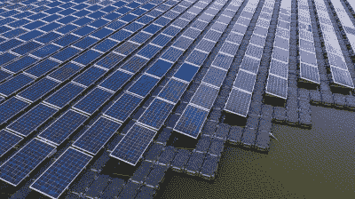

# 漂浮太阳能农场正在席卷世界水库

> 原文：<https://hackaday.com/2022/01/24/floating-solar-farms-are-taking-the-worlds-reservoirs-by-storm/>

光伏太阳能电池板是非常奇妙的东西，能够捕捉光并将其转化为有用的电能。它们通常安装在住宅和商业屋顶上，从源头上抵消能源消耗。

然而，对于电网规模的发电，它们通常被部署在接收大量直射阳光的大片土地上的大型农场中。这些要求经常会使太阳能农场与农场-农场发生冲突——有利于太阳能电池板的阳光也有利于种植植物，特别是那些我们用来种植食物的植物。

然而，一个更有趣的想法是制造漂浮在水上的太阳能电池阵列。与一些古怪的想法不同，这个想法也带来了一些真正有趣的工程好处！

## 没有听起来那么疯狂

Floating solar arrays have better efficiency than their land-based counterparts by virtue of the fact that the water keeps the cells cooler. (Adobe Stock photo.)

相对于典型的陆基装置而言,“浮托 voltaics ”(他们喜欢被称为“浮托 voltaics ”)具有显著的工程优势。其中一个主要的好处是冷却。像许多其他电子设备一样，太阳能电池板受益于保持在凉爽的温度范围内。当然，暴露在阳光下意味着，在发电时，太阳能电池板实际上被迫在高温下工作。商用光伏电池板的平均峰值效率只有 20%左右，太阳能电池板只能提供大约 1000 W/m²的能量，因此太阳能电池板在生产大量电能时已经面临困难。据挪威能源技术研究所的研究人员称，将太阳能电池板漂浮在水上的效率收益约为 5-6%[；当然没什么可嗤之以鼻的。将电池板完全浸入水中显示出更大的改进，在一些测试中效率提高了 11%](https://www.sciencedirect.com/science/article/pii/S0038092X21002085)[。](http://www.ijirset.com/upload/2014/january/5_Improving.pdf)

浮动太阳能电池板的好处也不止于此。例如，当漂浮在水库上时，太阳能电池板可以遮蔽河道，减少蒸发。支持者认为，这种效果可以通过结合遮阳和减少风的影响，节省高达 90%的水，否则这些水将在干燥的气候下流失到空气中。到达水面的较低水平的光也有减少藻类生长的好处，这是另一个好处。

由于这些原因，漂浮太阳能最常被提议与抽水蓄能大坝放在一起。这些设施依赖于在水中储存大量的势能，任何流失到大气中的水都是以后不能用来发电的水。更进一步的好处是，这些设施已经有基础设施将它们连接到电网，与在绿地开发阵列相比，使太阳能发电更具成本效益。

事实上，当谈到漂浮太阳能时，最大的好处可能是它减少了获取大片昂贵土地的需求。相反，像水库这样的现有河道可以增加太阳能，为电网提供电力，而不需要任何额外的地面足迹，除了一些公用事业盒。

漂浮在水上的太阳能电池板也有减少环境影响和清洁作业浪费的好处。浮动阵列不需要像在陆基装置中那样泵入清洁的水来清洗面板，而是可以简单地用它所漂浮的水来清洗。几乎没有水需要流失，因为它可以简单地从电池板上流下来。

## 缺点

然而，漂浮太阳能装置也有缺点。它们必须精心设计，以尽可能地管理和避免腐蚀，因为潮湿的环境可能会对布线、框架和组件造成恶劣影响。这种情况只会在盐水装置中加剧，从而进一步增加破坏性腐蚀的可能性。当然，腐蚀是一个可控制的问题，各种淡水和海水硬件的设计都可以承受这些环境。然而，它增加了处理这些问题的成本和时间，而这些问题在典型的陆基安装中并不是问题。

阵列本身也必须以这样的方式设计和组装，即不仅能漂浮，还能抵抗水上的动态力。在内陆水库中，这可能涉及被风激起的小波浪吹来吹去或摇晃，或者甚至在安装有泵送水电时处理摇晃、飞溅或来自进水口的水花。离岸应用也是可能的，但必须谨慎选择位置，以避免潮汐力和天气破坏硬件，正如 2019 年山仓大坝的[破坏所证明的那样。](https://solaredition.com/destruction-of-floating-pv-plant-by-typhoon-at-yamakura-dam-wind-resistance-in-spotlight/)

 [https://www.youtube.com/embed/_EEc1MTb7DM?version=3&rel=1&showsearch=0&showinfo=1&iv_load_policy=1&fs=1&hl=en-US&autohide=2&wmode=transparent](https://www.youtube.com/embed/_EEc1MTb7DM?version=3&rel=1&showsearch=0&showinfo=1&iv_load_policy=1&fs=1&hl=en-US&autohide=2&wmode=transparent)

自然，维护也更加困难，因为技术人员在浮动装置上工作更加困难，并且还会带来额外的健康和安全风险。与更典型的陆基装置相比，处理所有这些工程要求会显著增加浮式阵列的成本。

## 未来已经是现实

浮动太阳能电池阵列实际上已经在世界各地使用，这绝不是空想。目前运行的最大装机容量是位于中国德州的 [320 MW 装机容量](https://www.pv-magazine.com/2022/01/03/worlds-largest-floating-pv-plant-goes-online-in-china/)。该浮动阵列位于当地煤电厂附近的水库中，预计每年可产生 5.5 亿千瓦时的电力。它还与一个 100 兆瓦的风力发电场和 8 兆瓦时的电池存储在一起。

这也不是一次性设施。项目已经在世界各地展开，从伦敦的 6.3 兆瓦装机容量到加州 Healdsburg 号称美国最大的 4.78 兆瓦装机容量(T2)。

然而，最大的项目可能在亚洲。韩国计划建造漂浮在黄海上的 2.1 吉瓦的巨型太阳能发电厂。预计耗资约 40 亿美元，该项目将占地 7000 英亩，采用 500 万个太阳能模块来产生峰值输出。

同时，一个印度项目希望在 Omkareshwar 大坝建造一个 600 兆瓦的漂浮太阳能项目。该项目希望在 2023 年开始发电，超过位于该地点的水电站 520 兆瓦的发电能力。大坝本身主要用于储存灌溉用水，由于蒸发减少，太阳能装置可能会在水库中保持更多的水。

随着技术的成熟和各种管辖区看到了好处，漂浮太阳能的安装逐年增加。由于无需购买更多土地就能更高效地发电，很难否认漂浮太阳能的好处。预计它会迅速蔓延到你附近的水库和平静的沿海地区——假设你住在阳光充足的地方！