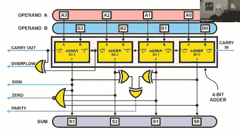
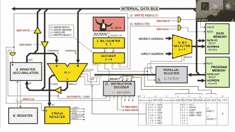

# Remoticon 2021 // Voja Antonic 让你成为数字设计师

> 原文：<https://hackaday.com/2022/01/27/remoticon-2021-voja-antonic-makes-you-a-digital-designer/>

[Voja Antonic]在我们许多人出生之前就已经在制造数字计算机了。他在 Z80 刚推出时就设计了它，并且有几十年的自由嵌入式经验，所以当他花时间为我们做演讲时，这是值得关注的。

在他的 Remoticon 2022 演示中，他将尝试在四十分钟内教我们如何成为硬件专家。嗯，大部分是数字的东西，但是如果你问我们，那对一次会议来说是足够的。[Voja]带我们从逻辑门的最基础开始，通过组合电路、时序电路，最终以通用微处理器的描述而告终。

A 4-bit ripple-carry adder with additional CPU flag outputs

正如他所展示的，复杂的数字电子系统实际上是由一系列越来越复杂的步骤组成的。从形成能够执行简单操作的逻辑元件的单个有源元件(作为开关操作的晶体管)开始。

从那里，更高层次的功能，如加法器，可以形成，并从这些 ALU 等等。从概念上讲，存储元件可以由逻辑门构成，但这不是最有效的方式，而且这些往往是用更小更快的电路制成的。但是无论如何，这个模型对于描述性的目的来说是很好的。

一旦你有了组合逻辑电路和存储元件，你就有了制造必要的解码器、序列发生器和存储电路来构建处理器和其他种类的更高复杂度的电路所需要的一切。

显然，40 分钟的时间根本不足以学习构建一个真正的微处理器的所有错综复杂的事情，例如与它接口和对它编程的烦人细节，但对于从仅仅了解二进制数到理解 CPU 是如何构建的学习曲线来说，这是一个很好的起点。

现在，如果你只能把目光从他的[光滑的游戏人生壁挂式 LED 显示屏](https://hackaday.io/project/178482-game-of-life-as-a-wall-poster)上移开，你可能会学到一两件东西。

 [https://www.youtube.com/embed/Z9s8HL6AuLk?version=3&rel=1&showsearch=0&showinfo=1&iv_load_policy=1&fs=1&hl=en-US&autohide=2&wmode=transparent](https://www.youtube.com/embed/Z9s8HL6AuLk?version=3&rel=1&showsearch=0&showinfo=1&iv_load_policy=1&fs=1&hl=en-US&autohide=2&wmode=transparent)

