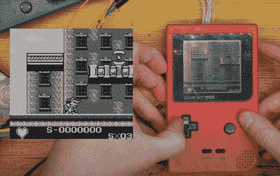

# ESP32 和树莓派接管游戏男孩液晶显示器

> 原文：<https://hackaday.com/2022/01/30/esp32-and-raspberry-pi-take-over-game-boy-lcd/>

任天堂游戏男孩和它的许多排列代表了有史以来最著名和最成功的游戏平台之一。几十年来，午餐室里最受欢迎的孩子是那个带来游戏机的孩子，这样班上的其他人就可以挤在一起，看看最新的口袋妖怪(Pokemon)游戏。

但是那些日子已经一去不复返了，现在这些曾经令人垂涎的掌上电脑可以在二手市场上廉价出售。这使得它成为检查最近发布的这个项目[kgsws]的最佳时间，该项目允许您将 Game Boy LCD 与 ESP32 或 Raspberry Pi 进行接口。在最基本的应用中，它可以让你通过 WiFi 把视频从你的 Linux 电脑推到 Game Boy LCD 上。但正如下面的视频所示，这只是冰山一角。

 通过在手持设备的 LCD 和主 PCB 之间连接 ESP32，微控制器还可以作为使用 I2S 相机模式的捕捉设备。与最终在手持设备的 LCD 上显示的内容相比，录制的游戏[kgsws]看起来棒极了。视觉效果清晰流畅，自然没有 Game Boy 标志性的(虽然有点恶心)绿色。

该项目还包括控制一系列游戏机液晶显示器的能力，这允许一些有趣的可能性。图像可以拉伸以覆盖多个显示器，[kgsws]通过在 3 x 3 网格的回收面板上玩游戏来演示，但每个 LCD 也可以单独控制，就像上面看到的大数字时钟一样。

无论你是在寻找一种在真实硬件上捕捉游戏的方式，还是 T2 想要在真实的游戏机屏幕上运行 RetroPie，我们都很期待看到人们使用这个项目会得到什么。

 [https://www.youtube.com/embed/gNlBDF8KRfo?version=3&rel=1&showsearch=0&showinfo=1&iv_load_policy=1&fs=1&hl=en-US&autohide=2&wmode=transparent](https://www.youtube.com/embed/gNlBDF8KRfo?version=3&rel=1&showsearch=0&showinfo=1&iv_load_policy=1&fs=1&hl=en-US&autohide=2&wmode=transparent)

