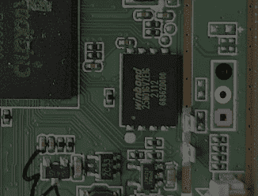
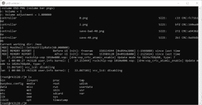

# Linux Arcade Cab 太容易泄露秘密了

> 原文：<https://hackaday.com/2022/02/01/linux-arcade-cab-gives-up-its-secrets-too-easily/>

有时候，逆向工程嵌入式系统可能是一个很老的 faff，你需要求助于各种技巧，如电源故障，以便在装甲上戳一个小洞，给你一条出路。而且，有时候门就是敞开着。这[详细探索了一个现成的复古街机](https://voidstarsec.com/blog//2022/01/27/uart-uboot-and-usb)，肯定是在第二个阵营，原因不明。VoidStar Security 的[Matthew Alt]详细研究了这个单元是如何工作的，这是对嵌入式 Linux 如何在这些最小系统上构建的一个很好的介绍。

Could this debug serial port be more obvious?

硬件是通常的 bartop 机柜，带有双控制器和一个 LCD 显示器，金属外壳内的容量刚好足以驱动演出。其中，主 PCB 具有预期的最小的基于 ARM 的应用处理器及其支持电路。处理器是 [Rockchip RK3128](http://rockchip.wikidot.com/rk3128) ，配备四核 ARM Neon 和 Mali400 GPU，但主要卖点是出色的 Linux 支持。你可能会看到这种芯片或它的亲戚驱动廉价的安卓电视盒子，它是 firefly 的这个[好看的“迷你 PC”平台](https://en.t-firefly.com/product/prime.html)的核心。也许有些东西值得考虑，因为树莓派目前很难得到？

无论如何，我们有点跑题了，[Matthew]以非常有条理的方式为我们进行了分解，首先是识别主要 IC 并下载适当的数据手册。接下来，他转向连接器，找到一个内部非面向用户的 USB 微型端口，这肯定会令人感兴趣。最后，相当明显的未填充 3 针接头被清楚地识别为串行端口。这是使用 Saleae 克隆捕获的，以验证它确实是一个 UART 接口并测量波特率。在这之后，他把它连接到一个 Raspberry Pi UART，并把标准的 screen 实用程序附加到串行设备上，你瞧，一个引导日志和一个根提示符！这件事真的是仓门大开。

Is that a root prompt you have for me? Oh why yes it is!

只需插入一个 u 盘，整个闪存就被复制了，包括分区和所有内容，提供了一个完整的备份，以防随后的黑客攻击把事情搞糟。基于 [U-Boot](https://www.denx.de/wiki/U-Boot) ，在启动时输入“Ctrl-C”是一件小事，他直接进入 U-Boot 命令行，所有配置都可以很容易地读出。通过使用 U-Boot 将 SPI 闪存通过 RAM 副本低级转储到外部 USB 设备，他证明了他可以反过来将相同的映像写回闪存，而不会破坏任何东西，因此现在可以对软件进行逆向工程，进行更改并写回。[这个过程的自动化是在树莓派上使用 Depthcharge](https://depthcharge.readthedocs.io/en/latest/) 完成的，这也是值得一读的。我们将密切关注他的博客，看他下一步会做什么！

正如我们之前所报道的，[嵌入式 Linux 真的无处不在](https://hackaday.com/2021/04/20/camera-hack-peels-back-layers-of-embedded-linux/)，一旦你有了硬件接入和一些软件支持，[开发新技术也不是那么困难](https://hackaday.com/2017/02/19/spi-on-embedded-linux/)。