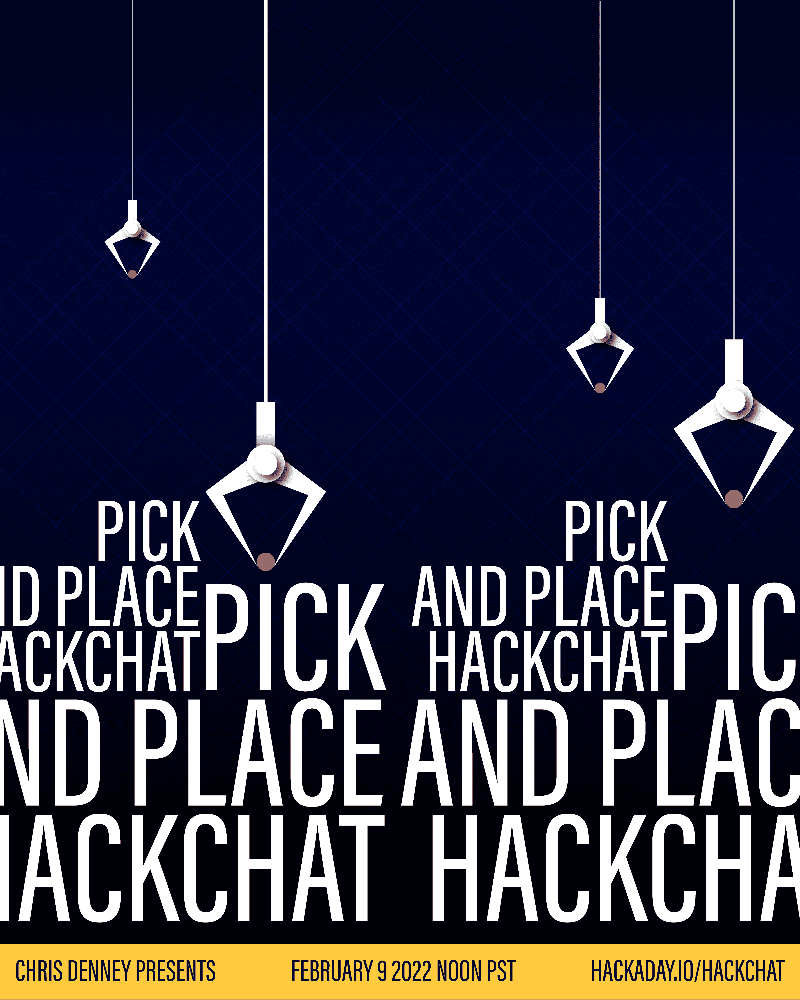

# 挑选并放置黑客聊天

> 原文：<https://hackaday.com/2022/02/07/pick-and-place-hack-chat/>

加入我们太平洋时间 2 月 9 日星期三中午与[克里斯·丹尼](https://hackaday.io/hacker/1240062-chris-denney)的[挑选并放置黑客聊天](https://hackaday.io/event/183578-pick-and-place-hack-chat)！

我们从事黑客行业的人非常习惯于奇迹——我们一直在创造奇迹。但即使是我们当中最疲惫的人也不得不承认，现代 PCB 组装近乎巫术，在这种组装中，可以轻易藏在一粒沙子下面的组件由机器人来处理。创造这些奇迹的抓放机不仅要准确无误地击中目标，而且要以令人目眩的速度连续几天完成。

幸运的是，即使是我们这些以设计电路为生并依赖 PCB 组装服务来实现这些设计的人，至少在某种程度上，也可以将工艺中的取放阶段的细节抽象化。但是让它“正常工作”并不是一个简单的任务，学习一点如何做到这一点可以让我们成为更好的设计师。另外，看着一个拾取和放置做它的事情是非常酷的。为了更深入地了解“挑选和放置”，沃星顿大会的首席技术官兼[“挑选、放置、播客”](https://www.pickplacepodcast.com/)的共同主持人 Chris Denney 将在 Hack Chat 上停下来。如果您曾经想知道 PCB 组装的内部工作方式以及拾取和放置在其中的作用，或者如果您正在寻找如何优化拾取和放置布局的技巧，这是您不想错过的！

我们的黑客聊天是在 [Hackaday.io 黑客聊天群发消息](https://hackaday.io/messages/room/2369)中的实时社区活动。本周，我们将于太平洋时间 2 月 9 日星期三中午 12:00 坐下来讨论。如果你被时区束缚住了，我们有一个[方便的时区转换器](https://www.timeanddate.com/countdown/generic?iso=20220209T12&p0=224&msg=Pick+and+Place+Hack+Chat&font=cursive)。

