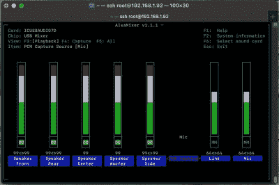

# 在 Linux Amplifier 上获得根增加了新的输入

> 原文：<https://hackaday.com/2022/02/03/getting-root-on-linux-amplifier-adds-new-inputs/>

我们还记得，在普通的台式电脑上安装 Linux 是一件非常棘手的事情，只有那些拥有最奢华的胡子的人才会尝试。在那些令人兴奋的日子里,“Linux 盒子”更像是从垃圾箱里抢救出来的一台过时的机器，侧板永远被拆除了，在地下室或车库里转动着。快进到今天，Linux 几乎无处不在:从智能手机和豪华车，到电视和冰箱。具有讽刺意味的是，在大多数台式电脑上还没有这种功能，但这是另一个话题了。

因此，当[迈克尔·诺斯哈德]提交了他如何[侵入他的 Linux 驱动的 Bluesound Powernode N150 放大器以解锁更多输入](https://nothhard.com/2022/01/17/adding-optical-input-to-a-bluesound-powernode-n150/)的有趣描述时，*最不令人惊讶的*元素是，有一个“智能放大器”在运行免费和开源的操作系统。激起我们兴趣的是，他能够相对轻松地闯入，并实现一些令人印象深刻的新功能，而制造商可能会一直保密。

Configuring the CM6206’s audio settings.

[Michael]解释说，N150 的背面有一个 USB 端口，官方说法是，它仅适用于大容量存储设备和少数经批准的外围设备，如蓝牙加密狗。但是，当他希望将更多的设备连接到输入受限的放大器时，他想知道是否可以获得操作系统识别的 USB 音频适配器。在利用一个已知的漏洞获得 root 访问权限之后，他开始研究底层的 Linux 系统，看看开发人员使用了什么样的诡计。

基于一个相当常见的 C-Media CM6206 芯片组，StarTech 7.1 USB 音频适配器被内核选中，没有问题。但是，为了让它与放大器的股票软件一起工作，他需要在系统的`sovi_info.xml`配置文件中添加一个新的`<capture>`条目，并对其默认的 ALSA 设置进行一些更改。修改了适当的文件后，新的 USB 音频输入设备在官方 Bluesound 智能手机应用程序下弹出。

在文章的最后，[Michael]指出，您需要通过一些额外的环节来确保上游固件更新不会抹去您所有的辛勤工作。幸运的是，听起来备份配置并将其返回到新闪存的 Powernode 非常容易。这些年来，我们当然看到了更多控制一个人音响系统的复杂方法。