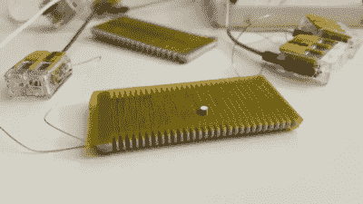

# PCB 步进电机微型机器人

> 原文：<https://hackaday.com/2022/02/03/pcb-stepper-motor-micro-robots/>

[Kevin Lynagh]对微型 PCB 步进电机很感兴趣，在回顾了迄今为止的各种项目和专利后，他决定亲自[试一试](https://kevinlynagh.com/pcb-stepper/)。这些基本上是一个被展开并制成扁平的步进电机 PCB 上的迹线充当线圈，微小的磁性“机器人”充当转子。

如果你想自己尝试这个概念，[Kevin]的帖子包含了对现有艺术和项目的出色调查，以及探索这些东西如何工作背后的理论。他已经深入研究了这个理论，深入到足以理解正在发生的事情，并带着一点信心建立了一些初步的原型。首先，它只是一个手动缠绕的扁平线圈，作为概念验证。接下来是一个几乎完全按照计划工作的 PCB 版本，尽管他承认在后退一步进行一些计算之前烧坏了一个电机驱动电路。

我们在 2014 年报道过[一个这样的项目，并在 2018 年](https://hackaday.com/2014/04/23/micro-robots-are-scary-awesome/)从读者【bobricius】那里写了一个 [Hackaday.io 磁力机器人项目。除了演示之外，您是否曾将这项技术用于其他用途？请在下面的评论中告诉我们。](https://hackaday.com/2018/05/22/smiling-robot-moves-without-wires/)

感谢[阿德里安]给我们发来的提示。