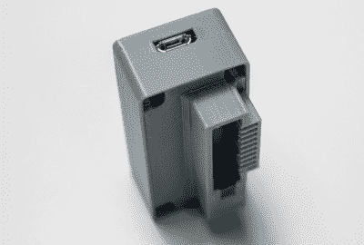

# 掌上便携式键盘无线化

> 原文：<https://hackaday.com/2022/02/08/palm-portable-keyboard-goes-wireless/>

很久以前，当数码便携式设备还处于婴儿期时，人们已经不愿意在微型键盘上打字了，不管是不是手写笔。因此，Palm 制造了一个可爱的便携式小键盘，可以折叠起来放在你的货物口袋里。我们现在有什么移动豪华打字？橡胶卷果冻 keebs？这个抄写员很难拒绝。

 但是为什么瞒过了 Palm 便携式键盘的成功呢？它只需要根据我们的时代进行更新，而[这正是【陈新明】用他们的 PPK 蓝牙适配器](https://github.com/pymo/ppk_bluetooth)所做的。

受到[cy384]制作 USB 适配器的工作以及[[克里斯蒂安]在 ESP32](https://hackaday.io/project/181800-palm-pilot-keyboard-bluetooth-conversion)上的努力的启发，[陈新明]指出这个版本更省电，更容易编程，并且有内置的 Li-Po 充电电路。它还使用硬件串口代替软件串口，节省了脑力。

这个版本真的没有太多东西，它依赖于 Adafruit Feather nRF52840，可以轻松地与 Palm III 和 Palm V 键盘一起工作。由于 PPK 是 RS-232，并且需要 TTL，因此该电路还需要一个电压电平反相器，它可以用少量元件制成。我们喜欢有一个隐藏的小开关，当适配器卡在连接器上时，它就会启动电池。

原理图、代码和 STL 文件都在存储库中，所以趁它们还在的时候，去电子湾买一个便宜的文件夹吧。休息后观看演示视频。

想要一个一体化的移动打字解决方案吗？查看微型计算机的历史。

 [https://www.youtube.com/embed/o8ccRMmagCI?version=3&rel=1&showsearch=0&showinfo=1&iv_load_policy=1&fs=1&hl=en-US&autohide=2&wmode=transparent](https://www.youtube.com/embed/o8ccRMmagCI?version=3&rel=1&showsearch=0&showinfo=1&iv_load_policy=1&fs=1&hl=en-US&autohide=2&wmode=transparent)

