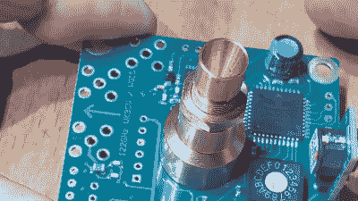

# 为 122 GHz 操作加工波导是精细的工作

> 原文：<https://hackaday.com/2022/02/12/machining-waveguides-for-122-ghz-operation-is-delicate-work/>

现代汽车中用于巡航控制和防撞的毫米波雷达通常被设计为工作在 100 米左右的范围内。然而，凭借一些工程常识，实验人员在一些测试中已经让这些设备在高达 60 公里的范围内发送信号。[加工和微波]决定看看他是否能把船推得更远，并开始加工一些波导组合器腔，这样他就可以把雷达芯片与一些非常高性能的天线一起使用。

Precision-machined components are required to successfully use these 122 GHz components for long-range transmissions.

该项目的最终目标是为汽车应用中常见的毫米波雷达芯片输出的 122GHz 信号生产 53 dBi 天线。在该频率下工作需要获得公差*以便制造性能良好的天线。*

大量的精细车床工作和愉快的加工戏谑之后，精密波导完成了。对于未经训练的人来说，它可能看起来不太像，但经过精心设计和加工，它不仅易于连接到雷达和抛物面天线系统，而且性能足够高，有望打破其他进取的无线电实验者创下的记录。如果这还不够困难的话，最后的工作包括制作 24 个这样的东西！

YouTube 上没有很多微波天线专用加工频道，所以如果你渴望这类内容，这个视频非常适合你。不过，如果你对低频天线更感兴趣，[你可能会发现一些你喜欢的其他故事](https://hackaday.com/2022/01/06/ham-antenna-fits-almost-anywhere/)。休息后的视频。

 [https://www.youtube.com/embed/uAG7y3tl9s8?version=3&rel=1&showsearch=0&showinfo=1&iv_load_policy=1&fs=1&hl=en-US&autohide=2&wmode=transparent](https://www.youtube.com/embed/uAG7y3tl9s8?version=3&rel=1&showsearch=0&showinfo=1&iv_load_policy=1&fs=1&hl=en-US&autohide=2&wmode=transparent)

【感谢门德斯尔的提示！]