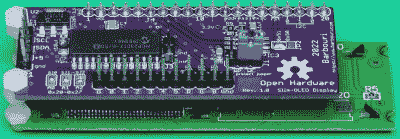

# 用于 OLEDs 的背包板拥有奇特的功能

> 原文：<https://hackaday.com/2022/02/14/backpack-board-for-oleds-boasts-fancy-features/>

当基于 HD44780 控制器的 LCD 字符显示器成为热门产品时，一种使其更易于使用的方法是以“背包”PCB 的形式出现，它同时提供了一个可访问的串行接口和出色的显示处理能力。[Barbouri]更新了这个想法，推出了一个背包板，它使用 US2066 显示驱动程序安装到有机发光二极管显示器上，并提供了一个具有强大而方便的高级功能的 I ² C 接口，使显示器易于使用。

 在软件方面，背包使用了[这个 I2cCharDisplay 驱动程序项目](https://github.com/dcityorg/i2c-char-display-library-arduino)，它提供了像光标控制、淡入淡出、显示移动，当然还有写字符或字符串这样的功能。虽然[Barbouri]专门为纽黑文超薄字符有机发光二极管显示器设计了该板，但理论上它应该可以与任何基于 US2066 的有机发光二极管字符显示器一起工作。[Barbouri]的斯利姆-有机发光二极管展示背包板的设计文件可以从项目页面直接下载[(链接在底部附近)，或者板可以直接从奥什公园](https://www.barbouri.com/2022/02/04/slim-oled-display-interface-board/)购买[。](https://oshpark.com/shared_projects/T1LVkKBc)

有机发光二极管的技术非常棒；我们已经看到了一些由[堆叠透明有机发光二极管显示器](https://hackaday.com/2021/03/04/volumetric-oled-display-shows-bladerunner-vibe-curious-screen-tech/)完成的巧妙把戏，[甚至看到了在家庭实验室中制作的 OLEDs】。](https://hackaday.com/2021/09/04/making-oled-displays-in-the-home-lab/)