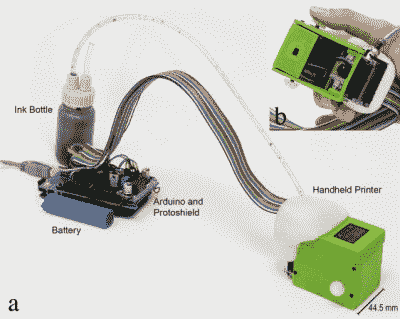

# Print-a-Sketch 可以将任何表面变成印刷电路板

> 原文：<https://hackaday.com/2022/02/15/print-a-sketch-turns-any-surface-into-a-printed-circuit-board/>

虽然强大的设计软件和廉价的制造服务使制作自己的 PCB 比以往任何时候都容易，但在某些情况下，一块 FR-4 并不能满足要求:想想带有隐藏 led 的艺术项目或需要附着在人体上的生物医学应用。在这种情况下，德国萨尔州大学的 Narjes Pourjafarian 和她的团队开发了 [Print-a-Sketch:一种手持设备，可以让你使用导电墨水在几乎任何表面上打印电路](https://hci.cs.uni-saarland.de/projects/print-a-sketch/)。也看看[他们的学术论文](https://narges-pourjafarian.github.io/assets/img/Print_A_Sketch.pdf) (PDF)。

该设备的核心是压电打印头，用于某些类型的喷墨打印机。它分配银纳米粒子墨水的微小液滴，这种墨水的导电性足以通过简单地打印一个原理图来制作有用的电子电路。可以画线来连接元件，而定制的封装可以容纳 led、电容器甚至集成电路。

 如下面嵌入的视频所示，打印草图可用于各种不同的模式。在手绘模式下，你只需移动设备就可以画出你喜欢的任何东西。但它也有几个辅助草图模式，可以理顺摇摆不定的线条，平行绘制多条线条，甚至打印完整的预定义形状。尤其令人满意的是，它可以通过印刷锯齿形线条来绘制电阻。

多亏了一个光学运动传感器，类似于游戏鼠标中使用的传感器，该设备随时知道自己在哪里，速度有多快。这使得控制电路能够补偿不稳定的运动；作者声称打印精度不到 0.5 毫米。此外，RGB 相机用于检测下面的材料，并根据表面的吸收能力调整墨水量:粗糙的纸比瓷砖需要更多的墨水来获得导电迹线。

潜在应用的数量似乎是无限的:集成触摸按钮来控制 iPad 上的视频播放器的瑜伽垫怎么样？一块带有集成拉伸传感器的运动学胶带，可以测量手臂的精确运动？还是带印刷湿度传感器的地板砖？所有这些都是由团队演示的，但我们确信我们的读者可以提出更多的想法。

当然，使用导电墨水绘制电路并不是一个新想法:以前的项目要么依靠[手工绘制整个东西](https://hackaday.com/2012/02/24/diy-conductive-ink-lets-you-freehand-circuits-on-the-cheap/)，要么使用[传统喷墨打印机](https://hackaday.com/2020/06/10/soon-inkjet-your-circuit-boards/)。但是打印草图复杂的硬件和软件真的让它自成一派。由于[整个设计都是开源的](https://github.com/HCI-Lab-Saarland/Print-A-Sketch)，你可以简单地构建一个并把你的想法带到生活中。

 [https://www.youtube.com/embed/nnvOC-OtINw?version=3&rel=1&showsearch=0&showinfo=1&iv_load_policy=1&fs=1&hl=en-US&autohide=2&wmode=transparent](https://www.youtube.com/embed/nnvOC-OtINw?version=3&rel=1&showsearch=0&showinfo=1&iv_load_policy=1&fs=1&hl=en-US&autohide=2&wmode=transparent)

