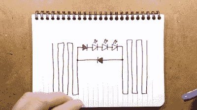

# 下面是这些不用电池的闪光手机贴纸的工作原理

> 原文：<https://hackaday.com/2022/02/26/heres-how-those-battery-free-flashing-phone-stickers-worked/>

90 年代末和 21 世纪初是手机的突破时期，廉价的 GSM 手机开创了几乎人人都有手机的时代。当时，定制手机的一种流行方式是安装一个贴纸，当手机响起时，它会闪烁。这些不需要电池或任何其他电话连接，[，【大克莱夫】已经开始解释它们是如何工作的。](https://www.youtube.com/watch?v=fVmLyladBy8)

The simple schematic of the flashing sticker circuit. The flashing was generated by the pulses of RF energy from the smartphone.

这是一种老式的拆卸方式，需要进行一些切割才能进入贴纸本身。一个典型的例子是三个 led 串联在一起，总压降约为 7V，连接到两个二极管和一个 PCB 走线天线。后来的发展使用未封装的原始元件粘合到 PCB 上。未来的版本下降到单个二极管，使用 led 作为第二个。基本理论是，当有电话打进来时，PCB 走线会拾取电话发射的射频，点亮 led。

在 2G 时代，使用的频率大约是 300 MHz 到 1.9GHz。根据[Big Clive]的说法，现代电话技术使用的频率变化和手机使用的较低发射功率的结合意味着标签不能在现代电话上正常工作。

顺便提一下，你可能会考虑运营自己的老式手机网络。休息后的视频。

 [https://www.youtube.com/embed/fVmLyladBy8?version=3&rel=1&showsearch=0&showinfo=1&iv_load_policy=1&fs=1&hl=en-US&autohide=2&wmode=transparent](https://www.youtube.com/embed/fVmLyladBy8?version=3&rel=1&showsearch=0&showinfo=1&iv_load_policy=1&fs=1&hl=en-US&autohide=2&wmode=transparent)

【感谢赞·阿特金斯的提示！]