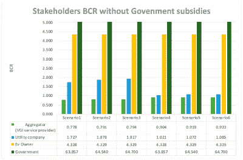

# 车轮上的电网电池:车网一体化的复杂物流

> 原文：<https://hackaday.com/2022/03/08/grid-batteries-on-wheels-the-complicated-logistics-of-vehicle-grid-integration/>

就其核心而言，车辆电网集成(VGI)的概念——也称为车辆到电网([V2G](https://en.wikipedia.org/wiki/Vehicle-to-grid))——似乎很简单。电池电动车(bev)将使用双向充电器，而不是单向充电器。这样，只要 BEV 连接到这样的充电器，电力就可以从汽车的电池中提取出来，在当地电网有需求时使用。

VGI 的许多复杂性已经讨论过了，包括这增加了 BEV 电池的磨损，需要将固有的移动机器插入充电器，以及需要 BEV 并发现其电池几乎耗尽的风险。在这里，来自日产汽车的令人愉快的营销，以及来自 T2 汽车和英国电网的商业倡议，听起来就像是一旦那些讨厌的细节被解决了，这是一件很容易的事情。

与光鲜亮丽的营销传单并行的是，研究人员一直在调查 VGI 作为电网级储能的潜在选择。这些研究得出了一个远不乐观的图景，对 VGI 的整个概念提出了质疑。

## 需求与供给的难题

在大多数 VGI 情景中，假设存在独立的利益相关方，参与方包括公用事业公司、VGI 服务提供商、电动汽车所有者，可能还包括政府。当从韩国的角度研究这种情况时， [Moon 等人(2021)](https://www.mdpi.com/1996-1073/14/3/761/htm) 得出的结论是，没有政府补贴，VGI 的经济不太可能成功。根本的问题是，由于涉及到管理费用和物流，任何利益相关者都很难获得可观的利润，如果有的话。

Moon 等人的分析引人入胜之处在于对韩国能源市场的描述，该市场既有公共事业公司，也有两级需求响应(DR)。韩国的 I 型 DR 主要适用于较大的工业电力用户，当要求他们减少负荷时，他们会得到激励。这是一个必须的回答，如果被要求时需求没有减少，将会被罚款。I 型灾难恢复合同有最大小时数和通话次数。

VGI stakeholders’ benefit/cost ratio without government subsidies. (Moon et al., 2021)

Type II DR 是一个需求方投标计划，涉及提交减载报价的相关方。在这里，如果要求的需求没有像提供的那样减少，也要受到惩罚。缔约方可以参加 I 型和 II 型灾难恢复，但 I 型优先于后者。在许多方面，这种灾难恢复系统可以被认为是一种负负荷跟踪和调峰系统。主要区别在于，不是公用事业公司向系统增加更多的供应，而是需求随时间推移或减少。

在 Moon 等人的分析中，当在这个系统的背景下考虑 VGI 时，利益相关者很难达到收支平衡。通过集中的 VGI 服务提供商增加对 VGI 计划的参与改善了情况，但没有政府补贴，不可能保证 VGI 服务提供商的利润。也许具有讽刺意味的是，当涉及的汽车不经常被用作汽车时，盈利的机会也增加了。这种想法导致了对 VGI 的另一种考虑，使用已经在一些地方使用的可交换电池系统。

## 放牧电池

虽然汽车大部分时间都在原地，即使是在 bev 的情况下，这也是非常真实的，但这不太可能总是在它们不断插入充电器的位置，更不用说 VGI 式的双向型充电器了。许多人会把他们的饮料放在车道上，或者停在路边。但如果你在停车时将电池从汽车中取出，你最终会得到一个类似电池交换站(BSS)的东西，它也提供电网级的存储服务，正如[曾等人(2020)](https://www.mdpi.com/2076-3417/10/22/8023/htm) 所提出的。

这种基于交换的系统的便利之处在于，每个 BSS 可以维护一个电池池，将这些电池中的大部分完全用于电网平衡，同时保持大量充满电的电池准备好插入电动汽车。这种电动汽车的大部分放电电池然后被添加到池中。

Battery Swapping Station workflow. (Zeng et al., 2020)

虽然避免了 BEV 使用模式的问题，包括它们基本上随机连接到电网和从电网断开，但以 BSS 为中心的系统的明显问题是，很少有电动汽车具有可更换电池。时至今日，这是日本和中国等国家的[出租车最常见的特征。](https://hackaday.com/2022/02/09/china-loves-battery-swapping-evs-but-will-they-ever-make-it-here/)

## 基本上是一个愚蠢的想法

鉴于来自专家的信息，VGI 持续受到如此多的关注是相当令人震惊的，例如 2016 年 J.B. Straubel 在担任特斯拉首席技术官时就是这样做的。正如 CleanTechnica 在[报道的那样，J.B .明确表示只有“智能”动态充电——主要在需求减少时充电——才有意义。J.B .还驳斥了旧的 BEV 电池可以重新用于电网级存储的观点，指出 BEV 电池与电网级存储电池的充电/放电周期要求非常不同。](https://cleantechnica.com/2016/08/22/vehicle-to-grid-used-ev-batteries-grid-storage/)

动态充电应该更容易让 BEV 车主注册。在旅行和停车充电时，充电率是最重要的。隔夜充电，唯一重要的方面是第二天早上上车时电池是否充满。

所有这些似乎都指向同一个问题:在两个截然相反的用例中尝试使用相同的电池之间的冲突。一个 BEV 的拥有者，当离开他们自己的设备时，除了在电力故障的情况下可能回到他们自己的家外，没有兴趣将电力反馈回电网。这使得财政激励成为 BEV 车主参与 V2G 计划的唯一原因。

然而，从 V2G 计划中获益的最有利可图的方式是让你的汽车全天候连接着充电器，而不是把它当作汽车来使用。然而，在这一点上，你只是在购买电池。所有这些都有助于强调为什么 V2G 在建立坚实的商业案例方面如此困难，而是在一次次审判中不断摸索。

## 智能充电车载 UPS

当考虑到可用的证据时，很容易证明对于公用事业和电网提供商来说,“智能充电”和需求响应方面既有吸引力又容易证明。很像韩国的大规模 DR 计划，消费者可能会被引诱让公用事业公司调节他们的电动汽车的充电速度，特别是为了一些补偿。对于公用事业公司来说，这可能有助于消除需求过剩，当人们下班回家，插上他们的 BEV 充电器，并把空调开到最大音量时，就会出现这种情况。

对于电动汽车的车主来说，双向充电器有一定的意义，因为它意味着在停电的情况下，车库中闲置的电动汽车可以安全地将电池中的电力输入到家庭电网中。这是一个逐渐在新的 bev 广告中被更多宣传的特征。与向当地公用事业公司出售 BEV 充电和放电循环的不确定前景不同，将自己的 BEV 用作应急发电机的花哨替代品具有直观的意义。

VGI 可能并不像某些人所说的那样是网格级存储的灵丹妙药。虽然电动汽车可以相对较好地执行更简单的任务，如电网频率稳定，因为这些任务需要相对较小的电池，但可以说，在电网中安装专用电池比希望足够多的人在正确的时间插入电动汽车更经济，以防止电网失去同步，使全国部分地区陷入黑暗，这与 2003 年发生的东北大停电没有什么不同。

鉴于国家电网开始时是多么复杂，我们最好不要设法将任何带电池的东西集成到电网中，尤其是当所述电池实际上可以随时离开时。