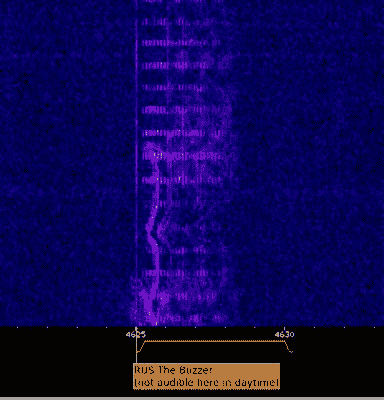

# 5 千赫宽的战场

> 原文：<https://hackaday.com/2022/03/04/the-battlefield-thats-5-khz-wide/>

电波中充斥着乌克兰战争的新闻，电视和广播记者无时无刻不在提供报道。但是对于那些有一点耐心的人来说，从无线电接收机的冲突中还可以发现一些其他的东西，[从 4625 kHz](https://twitter.com/kaedotcom/status/1497711396196433929) 开始的 5 kHz 频谱之战。多年来，这里一直是“[蜂鸣器](https://en.wikipedia.org/wiki/UVB-76)的位置，这是一种俄罗斯军用发射机，其昵称完美地描述了其单调的开/关嗡嗡声传输。随着当前乌克兰局势的形成，它已经成为一个小战场，蜂鸣器现在与其他各种广播音乐、频谱图和其他旨在扰乱它的无线电垃圾的电台共享频率。

The air raid siren produces a particularly distinctive spectrogram.

对于好奇的人来说，这可以通过频谱图或耳机由范围内任何一个拥有高频接收器的人观看，或者对其他人来说，通过网络 SDR 观看。在西欧，最好在黑暗的时候收听，我们建议你参考 webSDR.org 的列表，看看哪个信号最好。我们已经在[波兰](http://sdr.so8oo.net/)、[俄国](http://84.201.157.25:26057/)以及荷兰可靠的 [uTwente WebSDR](http://websdr.ewi.utwente.nl:8901/) 的接收器上听到过。随着时间的推移，我们一直在监测它，我们听到了重叠的讲话和音乐，从苏联和美国的国歌，通过舞曲和 K-pop 到 20 世纪 60 年代的英国摇滚，当然还有 Boney M 的 *Rasputin，*与一些稍微令人毛骨悚然的选择，如*最后倒计时*和空袭警报。我们甚至听过《班尼·希尔秀》、《明星团队》、《碟中谍》的电视介绍，所以不管是谁做的，口味都很广。

与此同时，伴随着 4628kHz 的音乐，我们看到一系列乌克兰语、俄语和英语的声谱图信息滚动而过，从“停止战争”到对俄罗斯总统的猥亵暗示。公平地说，这些传输都没有使蜂鸣器变得模糊，但它们却显著增加了信道上的噪声。

要亲自聆听，请在一天中的适当时间将接收器指向 4625 kHz，并选择 USB 解调和 5 kHz 带宽。同时，为了了解一些关于冷战高频遗迹的背景，[读一读关于数字站的文章](https://hackaday.com/2015/10/29/secret-radio-stations-by-the-numbers/)。