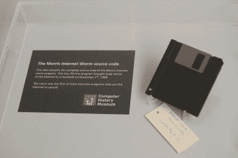

# 回顾:关于早期互联网病毒的 80 年代新闻报道

> 原文：<https://hackaday.com/2022/03/08/retrotechtacular-cheesy-1980s-news-report-on-early-internet-virus/>

那是 1988 年一个寒冷的秋夜。马萨诸塞州剑桥的人们躺在床上睡着了，没有意识到未来的恐怖即将从附近大学的实验室释放出来。这是一种病毒，但不是普通的病毒。这种病毒是一种计算机程序，它唯一的任务就是感染它能接触到的每一台机器。仅仅几个灵巧的击键就能让守法的公民从[这个由【Kahvowa】发布的倒退新闻卷轴](https://www.youtube.com/watch?v=fj8S6Hd-5bk)的头条报道中脱颖而出。

Computer History Museum exhibit featuring the original floppy disk used to distribute the Morris Worm computer virus.

公平地说，计算机病毒的概念当然需要对迈阿密风云时代的人们做一些解释。人们可能会碰到多台连在一起的计算机的唯一地方是银行或大学校园。麻省理工学院是这篇新闻报道中提到的校园，因为它是莫里斯蠕虫病毒的发源地。

莫里斯蠕虫以其创造者罗伯特·塔潘·莫里斯的名字命名，是首批通过网络计算机系统漏洞进行自我复制的程序之一。它的作者打算让这个程序成为一种良性的指出漏洞的方法，然而，它最终将自己多次复制到系统上，以至于崩溃。从受感染的机器上清除病毒通常需要几天时间，病毒造成的总损失估计高达数百万美元。

为了匿名，莫里斯最初在麻省理工学院的计算机实验室启动了他的蠕虫程序，当时他正在康奈尔大学学习。没用。莫里斯将成为第一个根据 1986 年计算机欺诈和滥用法案被判重罪的人。上诉结束后，他被判社区服务和罚款。大学毕业后，莫里斯共同创立了在线网络商店软件公司 Viaweb。会在 1998 年以 4900 万美元收购。几年后，具有讽刺意味的是，莫里斯以麻省理工学院电子工程和计算机科学系教授的身份重返学术界。

对不同种类的病毒感兴趣吗？看看去年的这段病毒简史。

 [https://www.youtube.com/embed/fj8S6Hd-5bk?version=3&rel=1&showsearch=0&showinfo=1&iv_load_policy=1&fs=1&hl=en-US&autohide=2&wmode=transparent](https://www.youtube.com/embed/fj8S6Hd-5bk?version=3&rel=1&showsearch=0&showinfo=1&iv_load_policy=1&fs=1&hl=en-US&autohide=2&wmode=transparent)

