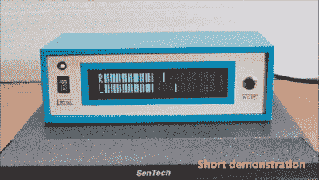

# VFD 字符显示变成音频 VU 计

> 原文：<https://hackaday.com/2022/03/09/vfd-character-display-turned-into-audio-vu-meter/>

人类喜欢将音乐形象化，无论是在 Winamp 中画出弯弯曲曲的难以理解的方程式，还是随着节拍跳动的简单 VU 节拍。来自[mircemk]的这个版本属于后一种类型，[重新利用 VFD 显示器来完成这项工作。](https://hackaday.io/project/184279-diy-arduino-vfd-display-20x2-vu-volumeunit-meter)

该项目围绕 VFM202MDA 真空荧光显示器展开，该显示器由 PT6314 驱动芯片驱动，提供我们都知道并喜爱的可爱的蓝绿色辉光。这样做的好处是，它可以很容易地由微控制器驱动，就像我们熟悉的 HD44780 字符 LCD 驱动芯片一样。通过一些小的调整，字符集可以被修改，使显示器成为一个令人惊讶的响应 VU 米。

一个 Arduino Nano 在表演，一个包络跟随器电路将左右声道的信号输入到微控制器的模拟输入端。Arduino 然后测量这些输入上的电压，并将必要的命令馈送给 PT6314 驱动器以更新显示。

最终的 VU 电度表每通道有 38 个小节，响应速度非常快。节拍条随着音乐快速闪烁，看起来很有吸引力，这个项目建造在与时代相适应的外壳中，增加了很多美感。

我们以前也见过其他的 VU 电度表，就像这个使用一点物理知识[来创建一个更真实的模拟指针式电度表。](https://hackaday.com/2021/08/09/improving-oled-vu-meters-with-a-little-physics/)休息后的视频。

 [https://www.youtube.com/embed/gotUokTuP9U?version=3&rel=1&showsearch=0&showinfo=1&iv_load_policy=1&fs=1&hl=en-US&autohide=2&wmode=transparent](https://www.youtube.com/embed/gotUokTuP9U?version=3&rel=1&showsearch=0&showinfo=1&iv_load_policy=1&fs=1&hl=en-US&autohide=2&wmode=transparent)

