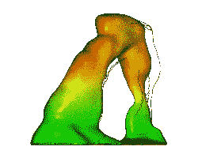

# 狩猎代表犹他州拱门之声

> 原文：<https://hackaday.com/2022/03/08/the-hunt-for-the-voice-of-utahs-arches/>

Double O Arch. Click to hear!

在 1990 年的电影《猎杀红色十月》中，一艘隐形潜艇通过计算机认为是地震的声音来定位，但当加速时，它们显然是机械的。我们不会再破坏它了，万一你还没看到呢。我们不禁想知道犹他大学的杰夫·摩尔教授和他的团队是否受到了这部电影的启发。为什么这样因为他们在他们的[红石色调](https://geohazards.earth.utah.edu/tones/)网站上记录了美国犹他州美丽拱门的地震振动，并将它们加速了 25 倍，正好放在人类听觉范围内。去听一听。我们就在这里。

由此产生的声音片段非常漂亮，其中一些声音在水下听起来有点怪异，就好像是由秘密推进系统驱动的一样。但这可能只是我们的想象有点跑偏了。然而，这可能是这个科学实验的目的——获取原始的科学数据，并使其可访问，甚至对非地质学家也有一定的意义。

The Dynamics of Rock Arches All Images Courtesy Prof Jeff Moore

[摩尔教授]和他的团队不只是为了好玩才在天然岩石拱门上放置地震仪，尽管这听起来确实很有趣。相反，他们正在研究这些岩层的自然共振，包括主频和谐波。通过监测共振频率随时间的变化，他们了解了岩石是如何变化的——特别是当它与人类对这些自然奇观的影响有关时。

更重要的是，这些地震波的听觉表现对有决心的黑客来说是可能的。我们已经展示了几个 DIY 地震仪，比如这个[被黑掉的 USB 鼠标，旨在探测移动中的大象](https://hackaday.com/2021/08/13/usb-mouse-hack-for-pachyderm-protection/)。它对测量地震活动足够敏感吗？尝试一下，并让我们知道！

特别感谢[杰夫·摩尔教授]允许本文使用这些图片。