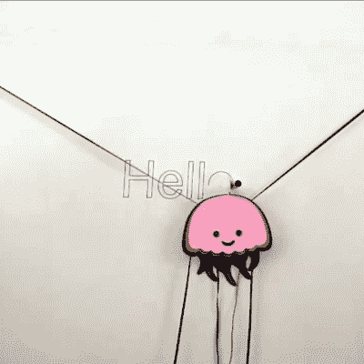

# 使其兼容

> 原文：<https://hackaday.com/2022/03/12/make-it-compatible/>

我可能和任何人一样，为一个项目的一个子部分重新发明轮子。见鬼，有时候我只是*觉得*喜欢做一个车轮设计。但是如果这是你选择的道路，你必须考虑其他人能否复制你的项目是否重要。普通车轮的好处是每个人都有一个。

 我脑海中的案例研究是[一个本周出现在](https://hackaday.com/2022/03/10/fumik-an-arduino-wall-drawing-robot-jellyfish/)黑客日的墙壁绘图仪项目。这是一个非常好的设计，从很多方面来说都是一个理想的起步项目。我实际上需要一个墙壁绘图仪(原因)和喜欢的选择。例如，几乎所有的东西，包括吊篮上的轻型齿轮步进器，都很容易安装和卸载——你只需固定好悬挂它的同步带，就大功告成了。无论如何，座舱上的额外重量有助于稳定性。它是开源的，基于 Arduino 库，所以应该很容易移植到我手头的任何微控制器上。

但是图像生成工具链很笨拙，包括剪切和粘贴到电子表格中，这将生成一个定制绘图微语言的文本文件。想必设计者不知道 Gcode，它本质上是移动机器的通用语言，或者只是不想实现它。其中在 Gcode 中，运动命令如“G1 X100 Y50”，本设备期望“draw_line(0，0，100，50)”。它们本质上是等价的，但不相容。

我完全理解作者一定花了很多时间来构思移动命令和编写将 SVG 文件转换成它们的电子表格。我去过那里，也做过那种事！但是，如果墙上的绘图仪说的是 Gcode 而不是自己的方言，它将立即进入任何数量的图形处理工作流，这将使我这个潜在的用户更高兴。

当你考虑重新发明轮子的时候，想想你的观众。如果你是唯一一个有可能看到这个项目的人，那就大胆去做吧。那样你会学到更多。但是如果你想和尽可能多的人分享这个项目，坚持最广泛使用的标准对你的用户来说是一个很好的选择，即使它没有想象出你自己的运动语言有趣。

This article is part of the Hackaday.com newsletter, delivered every seven days for each of the last 200+ weeks. It also includes our favorite articles from the last seven days that you can see on [the web version of the newsletter](https://mailchi.mp/hackaday.com/hackaday-newsletter-649368). Want this type of article to hit your inbox every Friday morning? [You should sign up](http://eepurl.com/gTMxQf)!