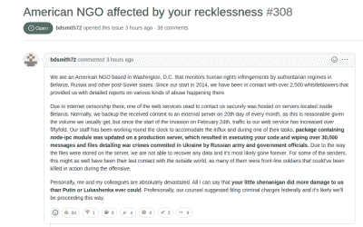

# 本周安全:更多的抗议软件，另一个 Linux Vuln，和 TLStorm

> 原文：<https://hackaday.com/2022/03/18/this-week-in-security-more-protestware-another-linux-vuln-and-tlstorm/>

看来我已经用“[抗议者](https://hackaday.com/2022/01/14/this-week-in-security-npm-vandalism-simulating-reboots-and-more/)”这个词在互联网安全史上留下了微小的、不可磨灭的印记。据我所知，我第一次创造这种特殊风格的恶意软件是在一月份报道 Faker.js/Colors.js 破坏事件的时候。

[另一个开发者【RIAEvangelist】在一个现有项目中插入了一些恶意代码](https://github.com/RIAEvangelist/node-ipc/issues/233) ( [镜像，因为投诉已经被删除](https://gist.github.com/MidSpike/f7ae3457420af78a54b38a31cc0c809c))，以抗议某些事情，在这种情况下是乌克兰战争。这里的行为是在桌面上写一张好看的纸条，宣扬“要和平不要战争”。然而，这个示例的一些版本有一个令人讨厌的惊喜——它执行 GeoIP 查找，如果检测到俄罗斯位置，它会尝试擦除整个驱动器。是的，`node-ipc`10 . 1 . 1 和 10.1.2 版本包含直接恶意软件。不清楚有多少用户运行了潜在的恶意代码，因为它很快被恢复并发布了 10.1.3。最新版本的`node-ipc`仍然创建桌面文件，Unity Hub 已经确认[他们在这种状态下发布了库，并且已经发布了修补程序](https://unity3d.com/hub/whats-new)。

 
这个故事还在继续发展，但也有一个`node-ipc`用户提出了一个问题，他自称与一个与东欧观察员合作的人权组织有关。[未经证实的说法](https://snippet.host/kvcb)是`node-ipc`在他们的揭发基础设施上运行，10.1.1 或 10.1.2 版本中的恶意代码清除了大量证据。虽然这可能是一个骗局——任何人都可以在互联网上声称任何事情——但存在法律诉讼的威胁，这将使这一说法成为现实。如果我们得到任何进一步发展的消息，我们会通知你的。

这种抗议软件的重复出现将迫使开源世界得出一些结论，即什么样的社会和政治评论在广泛使用的项目中是合适的。清除硬盘数据显然太过分了。尚不完全清楚代码是否打算向公众发布，因为它是在一个不相关的变更集中出现的，这表明要么是意外包含，要么是试图将其偷偷带入。但是在用户的桌面上创建一个虚拟的小册子呢？我认为这对于一个严肃的项目来说也是不可接受的。日志输出中的修辞呢？抗议者背后的动力似乎是不变的，所以我们需要找到这些问题的答案。

## 网络过滤器不是 RCE 的

接下来是另一个 Linux 内核漏洞的公告， [CVE-2022-25636](https://nickgregory.me/linux/security/2022/03/12/cve-2022-25636/) ，这是一个在 Linux 防火墙代码中的越界写入。如果一想到远程代码执行，您就突然感到心悸，试着放松一下。这个缺陷很严重，但就像我们上周讨论的 DirtyPipe 一样，它完全局限于可以运行 shell 命令的本地用户帐户。两个技巧允许任何用户用任何硬件触发漏洞，这意味着这是一个简单的特权提升。

这是一个更严重的问题，至少有两个概念证明可用:一个在上面链接的披露中，另一个在 Github 上，来自[Bonfee] 。该问题在内核 5.4 中引入，并在 5.16.12、5.15.26、5.10.103、5.4.182 中修复，并在即将发布的 5.17 中登陆。不幸的是，有不正确的报道称这个 CVE 在 5.6.10 中被修复，包括[NIST 页面上的 bug](https://nvd.nist.gov/vuln/detail/CVE-2022-25636#vulnConfigurationsArea) 。问题是 5.6.10 发布了一年多才发现问题。相应地调整你的回答。

## 如何砌砖成千上万的卫星终端

你可能已经看过欧洲几千个风力涡轮机突然失去与控制器的卫星连接的故事。终于有足够多的信息发布，可以拼凑出一个关于哪里出了问题的有根据的猜测。[Ruben Santamarta]结合他破坏卫星系统的经验和官方声明中给出的提示，给出了一个可能的解释。首先，这次中断与乌克兰战争有关，正在作为网络攻击进行调查。这可能是一个简单的 DDoS，但一名军方官员表示，“终端已经损坏，无法操作，可能无法修复。”DDoS 攻击通常不会破坏设备。

砖设备是什么闪存坏固件给他们。最有可能的情况是，俄罗斯攻击者要么入侵了一个地面站，要么伪造了它。他们利用这种连接和 TR-069 协议发送恶意固件更新。这次攻击摧毁了乌克兰、捷克共和国、斯洛伐克和德国的终端。

## 风暴

这是一个朗朗上口的名字，一个标志，甚至是一个漂亮的信息视频。TLStorm 不仅仅是昙花一现吗？也许——有三个严重的漏洞在起作用。Armis 的研究人员在 APC 智能 UPS 固件中发现了这些。

[https://player.vimeo.com/video/685464110](https://player.vimeo.com/video/685464110)

先说固件认证问题。为了真正确保恶意固件不能被安装，设备使用签名和加密的方法，签名密钥由制造商非常安全地保存。Smart-UPS 固件只是用一个对称密钥进行加密，这意味着相同的密钥用于加密和解密固件。在目标设备中完成的检查是解密新的固件，并对其进行完整性检查，通常是通过在头中寻找一个神奇的值。问题是共享固件兼容性的每个设备也共享相同的加密密钥。从一个单元中提取密钥使得攻击者能够为所有单元生成有效但恶意的固件。

第二个问题是 TLS 攻击中的一个人。这种方法利用了 APC 设备附带的 nanoSSL 库中的状态混乱。客户端试图与 APC 云通信，攻击者中断了初始握手。现在连接处于这种状态，攻击者可以发送 TLS 恢复消息，客户端接受它，跳过非常重要的 HTTPS 证书验证。

最后一个漏洞是 RCE，利用 TLS 碎片。攻击者发送一个分段的消息，然后不断发送超出预期字节数的片段，使分配的缓冲区溢出。这个允许完全控制，并链接到恶意固件问题。总之，这给了攻击者非常广泛的选择，从关闭下游设备到修改固件以诱导不安全的操作。好莱坞的比喻终于成真，黑客可以让[设备远程爆炸](https://tvtropes.org/pmwiki/pmwiki.php/Main/ExplosiveInstrumentation)。

## 比特和字节

你随身携带的这个漂亮的设备上有一个基带处理器和固件，这在历史上一直是一个非常不透明的组件。有一个新工具可以深入了解固件正在做什么， [FirmWire](https://github.com/FirmWire/FirmWire) 。这是一个基带模拟器，旨在让你模糊，调试，或者深入研究你的基带固件的秘密。

仅仅是我，还是谷歌 Chrome 最近有所上升？显然这一趋势是真实的，谷歌的研究人员已经注意到了 T1。他们指出了这一趋势的几个原因。Chromium 是最大的浏览器游戏，所以它自然是被攻击的对象。一个反直觉的观点是，更好的安全性会人为地增加漏洞数量，因为沙盒需要真正的攻击来将至少两个错误链接在一起，才能完成任何有价值的事情。这篇文章最后讨论了谷歌继续将 Chrome/Chromium 中的代码提升到更安全标准的计划。

还记得我们几周前报道的令人印象深刻的 WordPress fuzzing 工具吗？一些评论者想知道在哪里可以找到新工具的源代码。[WP 大蒜现在已经发布](https://github.com/kazet/wpgarlic)，准备好让你使用、改进和释放你的黑客创造力。如果你发现它有什么特别有趣的地方，一定要告诉我们！