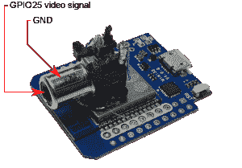

# 用 LVGL GUI 在 ESP32 上生成复合视频

> 原文：<https://hackaday.com/2022/03/27/generating-composite-video-on-esp32-with-lvgl-gui/>

RCA connector mounted to ESP32 board. (Credit: aquaticus)

微控制器没有专用的视频外设并不意味着它不能输出视频信号。这一点在 ESP32 上再次得到了验证，这次是由[aquaticus] [使用一个库](https://github.com/aquaticus/esp32_composite_video_lib)生成 PAL/SECAM 和 NTSC 复合信号。作为硬件方面的点睛之笔，[aqaticus]增加了一个 RCA 插孔，这是一个可选的额外功能。复合信号本身在 GPIO 25 上产生，有多种 PAL 和 NTSC 分辨率可供选择。

此外，还集成了 [LVGL](https://lvgl.io/) 支持:这是一个开源库，提供了一种跨平台的方式，为嵌入式平台提供图形化 ui。使用这种组合，任何 ESP32 都可以在单色或彩色显示器上生成完整的图形用户界面，为 ESP32 项目添加一些额外的风格和功能。

目前，这个库还不支持彩色输出，但是希望将来会增加。即便如此，加上使用 DAC 的简单 VGA 输出，该库提供了另一种方式来将模拟视频输出添加到无处不在的 MCU，如 ESP32。即使这些 MCU 不能以合理的速度解码任何视频格式，添加一个比基于 HD44780 的显示器和几个按钮更友好的用户界面也能真正提升用户体验。