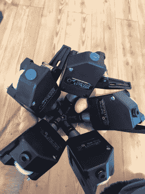

# 使用 NozzleBoss 在 Blender 中直接进行纹理贴图编码

> 原文：<https://hackaday.com/2022/03/31/texture-map-gcode-directly-in-blender-with-nozzleboss/>

我们最近已经看到了这款时髦的双盘极坐标打印机，但是海因茨·洛普迈尔一直在忙着开发它，所以这里有一个更新。这里的主要焦点是 [nozzleboss，一个混合插件](https://github.com/Heinz-Loepmeier/nozzleboss)，它使得已经切片的物体的表面纹理能够被操作。想法是读入对象的 gcode，并将其转换为 blender 运行所需的内部网格表示。从那里可以将所需的纹理应用到表面上，以供后续阶段操作。nozzleboss 可以做到的一个技巧是创建权重贴图，根据表面的像素值调整挤出流速或打印速度值——这样的“速度绘画”可以在以前毫无特色的脸上产生一些非常微妙的表面效果。另一个技巧是使用相同的权重贴图和简单的颜色贴图来混合文本块，这些文本块在导出时被注入到 gcode 中。这些 gcode 模块可用于交换工具头或挤出机，从而在同一物体中混合多种灯丝颜色或类型。

在该项目的 instagram 页面上可以看到一些这种打印操作的好例子。因此，再次回到硬件，下面嵌入的第一个视频显示了“双盘极性打印机”配备了一个疯狂的五挤出机到一个喷嘴混合 hotend 设置，它应该能够进行全 CMYK 颜色混合和一些。下面的第二个视频显示了机器的宽水平运动范围的有趣副产品，即整个打印区域可以转移到机架另一端的喷嘴。这提供了一种切换挤出机的新方法，只需移动整个床并在感兴趣的喷嘴下打印即可！最后一个观察结果是印刷表面，它看起来很像是直接在大理石板上印刷，我想这是我们第一次看到。

有趣的打印机设计这些天被研究了很多，这里有一个非常好的 [5 轴 prusa i3 hack](https://hackaday.com/2022/03/13/5-axis-3d-printing-for-the-rest-of-us/) ，如果你想留在笛卡尔世界，但你的台式机太小，那么你总是可以[加大它的尺寸](https://hackaday.com/2022/02/28/3d-printering-giants/)。

 [https://www.youtube.com/embed/Mnsa0zfxElA?version=3&rel=1&showsearch=0&showinfo=1&iv_load_policy=1&fs=1&hl=en-US&autohide=2&wmode=transparent](https://www.youtube.com/embed/Mnsa0zfxElA?version=3&rel=1&showsearch=0&showinfo=1&iv_load_policy=1&fs=1&hl=en-US&autohide=2&wmode=transparent)

 [https://www.youtube.com/embed/t2Nbi9dl5M8?version=3&rel=1&showsearch=0&showinfo=1&iv_load_policy=1&fs=1&hl=en-US&autohide=2&wmode=transparent](https://www.youtube.com/embed/t2Nbi9dl5M8?version=3&rel=1&showsearch=0&showinfo=1&iv_load_policy=1&fs=1&hl=en-US&autohide=2&wmode=transparent)

