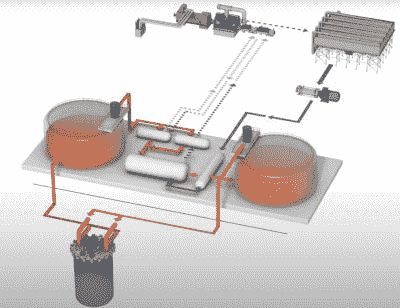

# 电表两侧的未来储能

> 原文：<https://hackaday.com/2022/04/13/the-future-of-energy-storage-on-both-sides-of-the-meter/>

如今，储能是一个热门话题，这对任何人来说都不足为奇。尽管如此，能量存储可以采取许多不同的形式，其中一些与公用事业提供商更相关(如电网级存储)，而另一些与企业和家庭所有者相关(如全屋存储)，还有一些技术生活在公用事业和个人利益之间的紧张地带，如(电动)[车辆到电网](https://hackaday.com/2022/03/08/grid-batteries-on-wheels-the-complicated-logistics-of-vehicle-grid-integration/)。

对于公用事业公司来说，闪亮的新技术，如基于氢的存储，正在制造许多噪音，而家庭和企业主正在思考仅依靠公用事业公司慷慨的上网电价的好处，而不是从屋顶的太阳能电池板为大电池充电并使用产生的电力。最终，这里的问题是，哪些技术真的会兑现他们的承诺，哪些是房主想要投资的。

## 应对不断变化的网格

Bath County Pumped Storage Station (Credit: CHA)

几十年来，电网一直是一个相对简单的系统，有可调度的发电机和消费者，前者在需要时生产，后者消耗，并有一些电网存储来消除颠簸和低谷。过去几十年来发生的最大变化是引进了发电机，这种发电机只有在天气和其他条件合适时才能发电。

其结果是山峰变得更高，山谷变得更深。虽然减少不必要的(过剩)电力可能是一个潜在的解决方案，但一个流行的想法是在以后通过某种方式储存尽可能多的过剩电力。此时，大多数电网级能量存储由压缩空气能量存储( [CAES](https://en.wikipedia.org/wiki/Compressed-air_energy_storage) )和抽水蓄能( [PHS](https://en.wikipedia.org/wiki/Pumped-storage_hydroelectricity) )提供。这两种技术的共同点是，它们都具有相对较低的体积能量密度，但通过具有较大的体积来弥补。

就第二大 PHS 系统而言，弗吉尼亚州的[巴斯县抽水蓄能站](https://en.wikipedia.org/wiki/Bath_County_Pumped_Storage_Station)，其上游水库的容量为 43，000，000 立方米 ³ (35，599 英亩-英尺)，这为其提供了足够的重力势能，以大约 3 GW 的功率提供 11 个小时的电力，总计 24 GWh。其往返效率为 79%，为 [PJM 互联](https://en.wikipedia.org/wiki/PJM_Interconnection)提供重要存储，缓冲能量，减轻电网各部分之间传输互联的压力。

CAES 的安装数量远不如 PHS 的安装数量多，这主要是因为寻找具有合适(气密)特性的地下洞穴的复杂性。因此，目前世界上只有两家 CAES 工厂在运行:美国阿拉巴马州麦金托什的 CAES 工厂和德国埃尔斯夫勒斯的 hunt orf CAES 工厂。前者的发电量为 2860 兆瓦时，后者为 870 兆瓦时。

由于这些 CAES 设备使用的非绝热过程，压缩过程产生废热，随后的膨胀需要输入热量。在这些现有工厂的情况下，天然气工厂用于此，在 McIntosh CAES 工厂的情况下，总系统效率为 27%，当与能量回收机制结合时，高达 40%以上。

对于 PHS 来说，可以经济地建造这种存储站点的潜在新站点的数量并不太多，这导致了对可以提供类似 PHS 的存储而没有后勤和环境复杂性的新技术的关注。

## 储氢

所谓的“氢经济”起源于 20 世纪 70 年代，当时这个术语是由约翰·博克里斯在通用汽车公司的一次演讲中提出的。其背后的主要驱动思想是，氢气可以用于工业过程的许多方面的脱碳，以及产生氨(NH [3] )，这是肥料的一种基本元素。也有人建议在转化回氢气之前使用氨作为中间形式。

此时，天然气(NG，主要是化石甲烷)提供了所用的大部分氢和氨。因此，使用过剩的电力通过电解产生氢气被认为是一种替代的来源。然而，这些都还没有发展成大规模的项目。与此同时，人们还在尝试将氢气混合到天然气中，达到一定的比例。由于氢气通过管壁扩散，天然气基础设施中的大量氢气会导致金属脆化等问题。

为了[储存氢气](https://en.wikipedia.org/wiki/Hydrogen_storage)，以备后用(如时移大量能量)，目前比较成熟的技术有[压缩](https://en.wikipedia.org/wiki/Compressed_hydrogen)和[液化](https://en.wikipedia.org/wiki/Liquid_hydrogen)。这里的复杂性是电解的直接能量损失(~20-30%)，氢气压缩或冷却的损失，储存容器的泄漏，以及如果需要转换回电力，氢燃料电池(HFC)的 40-60%效率。

根据研究，综合来看，基于氢的存储系统对电网的往返效率将在 18-46%之间。与 PHS 和 CAES 系统相比，这将大大降低效率，同时增加处理低温液体和高度易燃气体的复杂性和潜在危险。这使得这样的系统很难推销。当氢气需要立即使用时，问题还在于是否不能通过[辐射分解](https://en.wikipedia.org/wiki/Radiolysis)更有效地生产氢气。

## 热能储存

Overview of the thermal energy transfer in the Natrium reactor design. (Source: TerraPower)

相比之下，热能储存( [TES](https://en.wikipedia.org/wiki/Thermal_energy_storage) )明显更高效和直接。它以 T2 地热泵的形式得到了广泛应用，这种热泵可以非常有效地为建筑物制冷和制热。在工业环境中，熔盐储存是一种常见的[显热](https://en.wikipedia.org/wiki/Sensible_heat)储存方式，其概念背后是许多私人家庭使用的[蓄热式加热器](https://en.wikipedia.org/wiki/Storage_heater)。

在集中太阳能发电( [CSP](https://en.wikipedia.org/wiki/Concentrated_solar_power) )工厂中，熔盐通常被用来储存来自太阳光线的热量，之后被加热的盐可以用来产生蒸汽，供传统的蒸汽涡轮发电机使用。这也是 [TerraPower 钠](https://hackaday.com/2021/07/06/terrapowers-natrium-combining-a-fast-neutron-reactor-with-built-in-grid-level-storage/)第四代反应堆背后的工作原理，该反应堆利用核裂变产生的热量来加热盐。因为这种传热系统的热损失慢且效率高，所以即使在储存熔盐并且一周不使用其热能之后，它也可以用来发电或发热。

容量为 400 MWh 的系统需要一个高约 9 米、直径约 24 米的水箱，只使用可安全操作的常规材料(不热时)。与 PHS、CAES，尤其是氢基系统的复杂性相比，TES 最终可能会在储能领域发挥重要作用。也许并不令人惊讶的是，摩洛哥的瓦尔扎扎特 CSP 工厂是最大的能源储存工厂，其熔盐储存量为 3005 兆瓦时。

## 保持简单

即使 PHS 和 CAES 的容量不太可能再大幅增加，公用事业提供商似乎仍可以考虑采用多种技术来增加存储容量，即使不求助于电化学电池。这也给了私人住宅和企业主一些提示。

由于并网存储不太可能出现大规模扩张，电网运营商几乎没有动力去激励太阳能和风能的间歇性供电。当可以选择使用本地安装的光伏太阳能电池板以及太阳能热水系统(有时组合在同一个电池板中)来为安装在同一栋建筑内的电池充电并加热水时，该系统的成本是高度可预测的，并由公用事业提供商未使用的电力(和天然气)来补偿。

由于能源市场和当前世界经济的诸多不确定性，很难说未来几年将会发生什么，但坚持行之有效的系统，并着眼于小生产者的本地消费可能是正确的选择。

[标题图片:黄昏时分，瓦尔扎扎特电站的努尔三号太阳能塔。(鸣谢:马克·拉科斯特)]