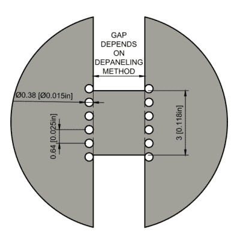

# 揭示制作 PCB 分离片的最佳方法

> 原文：<https://hackaday.com/2022/04/09/best-ways-to-make-pcb-breakaway-tabs-revealed/>

我们大多数人都熟悉在面板中生产 PCB，然后再将它们拆开的概念。穿过 PCB 大部分路径的 v 形槽是解决这个问题的一种方法，但是一条穿孔线是另一种方法。但是用什么样的孔最合适呢？Sparkfun 的【尼克·普尔】[花了大约 400 美元在多氯联苯上，通过把它们一个个分开，并判断结果，得到了一些可靠的答案](https://www.sparkfun.com/news/4400)。

创建穿孔线(或“老鼠咬痕”)的好处是，钻孔在 PCB 生产中是一件非常正常的事情，这使得创建这种分离式拉环成为一种非常简单灵活的方法。然而，得到恰到好处的结果可能很棘手。太结实了，分开很麻烦。太弱，木板可能会提前断裂或扭曲。最重要的是，边缘也必须整齐地断裂。[在](https://hackaday.com/2019/03/12/panelizing-boards-in-kicad/)之前，我们已经报道过以这种方式面板化 PCB，但这是我们第一次看到有人认真研究如何创建最佳分离式拉环。

Placing holes tangent to the board edge (as shown above) isn’t the prettiest, but keeps PCB edges free from protrusions. This is best for boards that are rail-mounted, or have tight enclosures.

关于设计老鼠咬痕的数据很少，而且有点不一致，所以[Nick]决定根据经验找出答案并分享结果。完整的细节可在 [*制作更好的鼠咬器* (PDF 下载)](https://cdn.sparkfun.com/assets/home_page_posts/4/4/0/0/Mousebites_Whitepaper_Final.pdf)中找到，但建议的本质是:0.015”未电镀的孔，间隔 0.025”(中心到中心)，最大 0.118”宽的拉片(以便与去平板化工具兼容)，以及延伸到分离拉片的角落以避免锋利边缘的孔。孔的位置应该稍有不同，这取决于人们是否希望优化纸板边缘的外观和物理光滑度，但这些数字是指导原则的核心。

为了进行微调，[Nick]建议增加孔之间的间距以增加强度，或者只是增加额外的凸片。PCB 的厚度呢？[Nick]测试了 0.8 毫米和 1.6 毫米厚的电路板，虽然需要不同的扭矩来将电路板分开，但不管 PCB 厚度如何，一切仍按预期运行。

归根结底，*最佳*数字最终将是您的工艺或晶圆厂能够最有效处理的数字，但[Nick]的数字不应该误导任何人，看到这种工作改进如此常见的 PCB 特性真是太棒了。