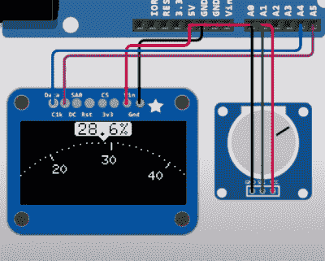

# 有机发光二极管显示器踢旋钮几个准确的缺口

> 原文：<https://hackaday.com/2022/04/19/oled-display-kicks-knob-up-several-accurate-notches/>

就输入设备而言，电位计非常简单:向左旋转，向右旋转，你就能看到所有能看到的东西。对于许多应用程序来说，这就是你所需要的，但我们肯定可以通过现代技术来改善体验。进入这个来自[upir]的[有前途的项目，它将一个普通的电位计与一个便宜的有机发光二极管显示器](https://wokwi.com/projects/327642884399432274)配对，以产生一个更吸引人的用户体验。

To save time, the code is fine tuned in a simulator.

基本想法是将显示器安装在电位计旋钮上，这样您可以显示有用的信息，如显示其功能的标签，以及当前检测值的读数。但是您可能还想显示旋钮当前在可能值范围内的位置，这就是事情变得有趣的地方。

在休息后的视频中，[upir]花了相当多的时间解释细节背后的数学原理，比如滚动的刻度线。近 45 分钟长的视频以一些优化结束，因为在 Arduino UNO 上让显示器随着旋钮实时移动需要一点额外的努力。最终的结果看起来很棒，并承诺是一种相对便宜的方式来为一个基本的旋钮添加一点优雅和功能性的天赋。

有了代码和它如何工作的大量演示，给你的下一个配备旋钮的小工具添加类似的功能应该不是太大的挑战。也许它甚至可以与我们之前讨论过的有机发光二极管·VU 仪表结合使用。[如果你最终使用这种技术，一定要让我们知道](https://hackaday.com/submit-a-tip/)，因为我们很想看到它的实际应用。

 [https://www.youtube.com/embed/NPfaLKKsf_Q?version=3&rel=1&showsearch=0&showinfo=1&iv_load_policy=1&fs=1&hl=en-US&autohide=2&wmode=transparent](https://www.youtube.com/embed/NPfaLKKsf_Q?version=3&rel=1&showsearch=0&showinfo=1&iv_load_policy=1&fs=1&hl=en-US&autohide=2&wmode=transparent)

感谢[马克]的提示。