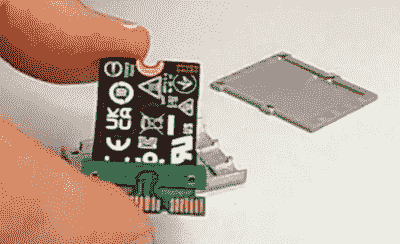

# 开发你自己的数字电影

> 原文：<https://hackaday.com/2022/04/20/developing-your-own-digital-film/>

在过去，你会有一卷胶卷，可以拿到当地的药店让他们冲洗。但是一个严肃的摄影师可能会自己冲洗照片，以保持完全的创造性控制。虽然照片编辑软件已经在很大程度上取代了过去的暗房，但图像仍然保存在物理介质上，这意味着还有改进和定制的空间。在为 *photofocus* 、[【Joseph Nuzzo】撰写的一篇文章中，他展示了如何以不到 100 美元的价格制作自己的 CFexpress 卡](https://photofocus.com/photography/how-to-make-your-own-cfexpress-card-for-under-100/)，这是数码相机存储技术领域最新、最棒的产品。

 这里的想法很简单，因为 CFexpress 使用带有不同连接器的 PCIe。基本上，你所要做的就是得到一个 m . 2230 NVMe 硬盘，并把它放入一个适配器。在这种情况下，[Joseph]使用的是 Sintech 的交钥匙模型，但我们过去已经[展示过如何推出自己的](https://hackaday.com/2016/09/21/creating-a-pcb-in-everything-introduction/)。

现在你可能不会正常地考虑它，但是 NVMe 设备变得非常热。在大型计算机机箱中，这通常不是问题，因为它们经常有大量的空气吹过。但在相机内部，你需要散热，所以热化合物是必须的。所有东西都拧在一起，你就有了自己的卡，比商业产品更快更便宜。

众所周知，人们非常爱 NVMe。它简单、快速、适应性强。由于 M.2 插槽格式包括 SATA 和 PCIe，许多相机中很可能有 PCIe 总线。码头上的 [PCIe 巴士方便了黑客](https://hackaday.com/2020/07/01/adding-pcie-to-your-raspberry-pi-4-the-easier-way/)，我们想知道那里有什么样的摄像头黑客。