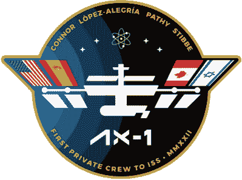
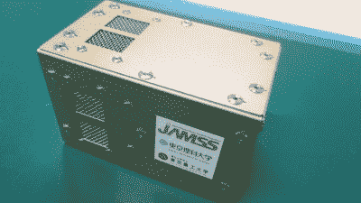

# Axiom 的私人 ISS 任务不是太空度假

> 原文：<https://hackaday.com/2022/04/25/axioms-private-iss-mission-was-no-space-vacation/>

在一个任何有足够财力的人都可以搭便车到太空边缘并返回的时代，你会被原谅认为 [Axiom 的 Ax-1 任务到国际空间站](https://www.axiomspace.com/ax1)只不过是四名机组人员的一次愉快的巡航。诚然，这是一次比威廉·夏特纳和杰夫·贝索斯等国已经开始的亚轨道飞行更高、更快的飞行，但它肯定仍然只不过是那些钱多得不知道该怎么花的人组织的一次宣传噱头？

 谢天谢地，事情远不止如此。虽然这项任务是由私人资助的，但 Ax-1 机组人员不仅仅是轨道观光者。首先，SpaceX Dragon 有大量现实世界的经验:该任务由 NASA 资深宇航员迈克尔·洛佩斯·阿莱格里亚(Michael López-Alegría)指挥，机组成员拉里·康纳(Larry Connor)和埃坦·斯蒂贝(Eytan Stibbe)都是出色的飞行员，后者在以色列空军服役期间曾在各种战斗机上飞行数千小时。

但更重要的是，他们有工作要做。每个成员都被分配了一份他们要进行的实验清单，范围从医学观察到新硬件的测试。当然会有一些停机时间——毕竟，如果你花了 5000 万美元买了一张去太空的票，你至少会有一点乐趣——但这不仅仅是一次拍照:Axiom 在寻找结果。对老板也没有隐瞒，因为洛佩斯-阿莱格里亚不仅仅是任务指挥官，他还是 Axiom 的业务发展副总裁。

当你考虑到该公司的最终目标是利用国际空间站作为跳板来加速他们自己的商业空间站的发展时，这是有道理的。Ax-1 期间收集的数据对 Axiom 的前进道路至关重要，他们的第一个模块已经在建设中，预计将于 2025 年推出，没有时间可以浪费。

那么，这次私人资助的国际空间站任务的成员们完成了什么呢？让我们来看看一些更有趣的条目。

## 未来站技术

虽然 Axiom 目前在技术上可能从事太空旅游业务，但他们的目标是最终为政府和商业宇航员建立一个进行太空研究和制造的目的地。他们不是从零开始，而是想在国际空间站上建造一系列模块，这些模块最终可以分离，并在空间站正式退役后充当自由飞行站。

既然如此，毫不奇怪 Ax-1 机组人员的任务是评估将在不久的将来的空间站上有用的各种技术。其中最主要的是由日本载人航天系统公司开发的光触媒空气净化装置。该设备使用发光二极管和一种特殊的过滤介质来消除空气中的气味，这是一个长期困扰这个有 20 多年历史的轨道实验室的问题。

JAMSS Developed Air Purifier

任务专家 Mark Pathy 还负责研究双向“全息移动”，这是一种通信技术，允许用户通过增强现实耳机看到与他们交谈的人的 3D 图像。

美国宇航局之前在去年 10 月测试了这一概念的单向版本，来自地面的呼叫者看起来就像他们在空间站一样，但 Ax-1 任务首次展示了从轨道传输图像的能力。考虑到更多的个人和互动交流，美国宇航局认为这项技术对于长期太空飞行将变得越来越有价值。

Eytan Stibbe 研究的技术之一是由以色列初创公司 NSLComm 开发的可部署高增益天线。这种天线的设计使得反射器可以在发射时紧密包装，只能在微重力环境下测试。虽然主要用于小型卫星，但这种可展开结构被认为是未来轨道设施和航天器的关键技术。

## 太空建筑

自然，一个商业空间站需要有客户。为此，Axiom 对利用低地球轨道永久设施提供的独特微重力环境的技术特别感兴趣。

以 Eytan Stibbe 负责的流体空间光学项目为例。在微重力下，用液态聚合物填充刚性框架，由于表面张力，自然会产生完美的球形。当用紫外光固化时，结果是一个光学透镜，在地球上只能通过费力的研磨和抛光来生产。这种技术有可能生产任意比例的高质量光学器件，使太大或太脆弱而无法从地面发射的太空望远镜的轨道结构成为可能。

指挥官 Michael López-Alegría 也致力于小规模演示麻省理工学院的自我组装太空建筑概念。瓦片的边缘具有电永磁体，并且具有自主操纵的能力，这些瓦片可以相互连接，以创建比火箭有效载荷整流罩大得多的结构。虽然显然处于当前技术可能实现的边缘，但 TESSERAE 是一个迷人的视角，展示了拥抱微重力如何能够实现独特的外星建筑形式。

 [https://www.youtube.com/embed/1OwoOuoDf0k?version=3&rel=1&showsearch=0&showinfo=1&iv_load_policy=1&fs=1&hl=en-US&autohide=2&wmode=transparent](https://www.youtube.com/embed/1OwoOuoDf0k?version=3&rel=1&showsearch=0&showinfo=1&iv_load_policy=1&fs=1&hl=en-US&autohide=2&wmode=transparent)

## 充满希望的开端

Axiom 目前与 SpaceX 公司签订了一份合同，在 2023 年前再进行三次飞往国际空间站的飞行，每次都载有四名机组人员。除了美国宇航局宇航员佩吉·惠特森将指挥 Ax-2 和赛车手约翰·肖夫纳将担任飞行员之外，公众对这些未来任务知之甚少。人们还预计真人秀选手将获得两个席位，尽管我们从火星一号上了解到，任何来自娱乐行业的说法都应该持保留态度。

无论谁最终在未来的 Axiom 任务中被捆绑到龙中，我们只能希望他们被保持与 Ax-1 的机组人员相同的标准。由于商业载人航天仍处于起步阶段，当务之急应该是将我们中最优秀和最聪明的人送上具有真正影响和切实利益的任务。有一天，普通退休人员可能会有机会在欧洲度假和短途轨道旅行之间做出选择，但在此之前，还有大量工作要做。