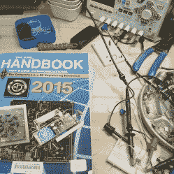

# 边做边学电子学

> 原文：<https://hackaday.com/2022/04/25/learning-electronics-by-just-doing-it/>

学习任何新的东西，尤其是像电子学这样广泛而深远的东西，可能会很难。[IMSAI Guy]知道这一点，因为他经常被问到“我如何学习电子学？”许多阅读这篇文章的人会有一些想法要分享(我们鼓励你在下面的评论中分享你的观点),但有更多的人在问同样的问题，而[IMSAI Guy]的观点是这位特殊的 Hackaday 作家可以理解的。

The ARRL Handbook can be found at hamfests, radio clubs, libraries, or at arrl.org

根据[IMSAI Guy]的说法，一个很好的起点是《ARRL 手册》。《ARRL 手册》是美国业余无线电中继联盟出版的电子和射频工程指南。这是一个很好的参考，过去的版本可以很便宜地买到，而且非常方便。许多火腿会有一本可以讨论的书，你可以在当地图书馆找到一本。那么，从手册的哪里开始呢？

[IMSAI Guy]建议从你感兴趣的东西开始。例如，他从运算放大器开始，而不是直接研究它们如何工作的数学，甚至不去担心它们是什么——他只是构建一个电路，然后玩它，从本质上理解它的工作原理，这是一种“边做边学”的方法，他发现这种方法非常有用，就像我们许多人一样。我们也欣赏这种非常简单的数学方法:除非出于某种原因需要，否则不要费心去做，而且绝对不要一开始就学习它。

事实上，同样的道理也适用于任何学科:当你需要的时候学习它，不要从学习开始，而是从做开始。学习会自己来！请务必查看整个视频，并让我们知道您的想法，以及您是如何学习电子学的。感谢[cliff]的精彩提示！

 [https://www.youtube.com/embed/Bgrubw6B_us?version=3&rel=1&showsearch=0&showinfo=1&iv_load_policy=1&fs=1&hl=en-US&autohide=2&wmode=transparent](https://www.youtube.com/embed/Bgrubw6B_us?version=3&rel=1&showsearch=0&showinfo=1&iv_load_policy=1&fs=1&hl=en-US&autohide=2&wmode=transparent)

