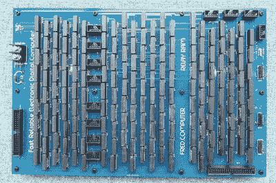

# 这台巨大的真空管计算机玩着一场卑鄙的乒乓游戏

> 原文：<https://hackaday.com/2022/05/02/this-colossal-vacuum-tube-computer-plays-a-mean-game-of-pong/>

我们很少报道基于新真空管的计算机设计。然而今天，我们很高兴向你介绍[快速可靠的电子数字点计算机](https://www.fred.computer)，或弗雷德。简称电脑。这是[迈克]的主意，他也给我们带来了 ENA 和[，我们之前已经介绍过了](https://hackaday.com/2021/07/12/the-first-new-vacuum-tube-computer-design-for-well-over-half-a-century/)。

弗雷德是一个新的设计，重复使用组成 ENA 的部分。它有一个 8 位 CPU，16 字节的 RAM，256 字节的 NVRAM，运行时钟速度为 11.3 kHz。它有 560 个灯管，总供电电流约为 200 A，也为[Mike]的研究提供了相当多的热量。主要逻辑通过或非门实现，或非门由来自东欧的 6N3P 双三极管组成。这些或非门被组合成更复杂的结构，如锁存器、寄存器甚至一个完整的 ALU。总共十六条机器代码指令可以用来编写程序；巧妙的设计使 Fred 可以用其 8 位 ALU 执行 16、32 甚至 64 位计算。

Need some RAM? There’s sixteen bytes right here.

一个有趣的补充是基于簧片继电器的新 RAM 设计。[Mike]意识到继电器实际上非常类似于数字传输门，因此可以用来制作简单的静态 RAM 单元。如果你认为继电器对于 RAM 单元来说太慢，请再想想:这些簧片继电器可以以令人难以置信的 700 Hz 切换，这对于 Fred 来说已经足够快了。

主 I/O 设备是一个控制台，其中包含几个按钮以及一个 12 x 8 LED 显示器。所有这些使弗雷德成为一台功能齐全的通用计算机，甚至能够玩乒乓(视频，嵌入下方)。[迈克]的网站上充满了关于真空管计算机设计各个方面的有趣细节，对于任何想自己动手建造的人来说都是令人愉快的读物。

对真空管电脑看不够？看看[这个 1 位 MC14500 实现](https://hackaday.com/2021/12/27/single-bit-computer-from-vacuum-tubes/)，惊叹[这个加法机的现代演绎](https://hackaday.com/2021/12/28/1950s-vacuum-tube-computer-replica-communicates-through-usb/)，或者了解一下[IBM 在 50 年代是如何设计其逻辑的](https://hackaday.com/2020/09/10/reverse-engineering-a-module-from-a-vacuum-tube-computer/)。

 [https://www.youtube.com/embed/pruQAxY9yTI?version=3&rel=1&showsearch=0&showinfo=1&iv_load_policy=1&fs=1&hl=en-US&autohide=2&wmode=transparent](https://www.youtube.com/embed/pruQAxY9yTI?version=3&rel=1&showsearch=0&showinfo=1&iv_load_policy=1&fs=1&hl=en-US&autohide=2&wmode=transparent)

