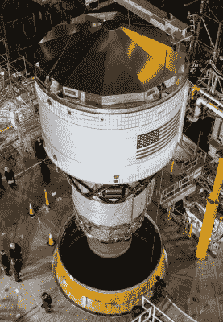

# 美国宇航局的巨型 SLS 火箭回滚维修

> 原文：<https://hackaday.com/2022/04/27/nasas-giant-sls-rocket-rolled-back-for-repairs/>

毫无疑问，火箭表演中最激动人心的动作是在一团火焰中向天空发射。但如果不是这样，看看这些巨大的交通工具在被发射到黑暗中之前是如何在陆地上变戏法的还是很有趣的。这对任何对美国宇航局高耸的太空发射系统(SLS)感兴趣的人来说都是很好的消息，因为它已经在地面上为旨在让人类重返月球的车辆做了大量的工作。

最近，SLS 完成了从标志性的车辆装配大楼(VAB)到发射台 39B 的长途跋涉，并再次乘坐同一辆“履带车”返回，这辆车曾在它之前运送过航天飞机和土星五号。虽然近 60 岁的履带式车辆已经得到了一些更新，以携带 98 米(322 英尺)高的助推器，显然航天局赞同“如果它没有坏，就不要修理它”的思想。

The ICPS being loaded onto the SLS

然而，补充劳工计划本身肯定需要一些工作。3 月 18 日，火箭第一次被带到发射台，在那里它将进行所谓的“湿彩排”——对飞行前操作、推进剂装载和倒计时的测试，包括除发动机点火以外的一切。不幸的是，测试受到技术问题的困扰，在三次尝试后，决定将火箭带回 VAB，对火箭和地面支持设备进行必要的维修。

其中一个问题涉及临时低温推进阶段(ICPS)的一个阀门，这是一个在早期 SLS 飞行中使用的推进模块，用于提供跨月球注射(TLI)燃烧，这将[将猎户座飞船发送到月球](https://hackaday.com/2019/03/25/could-orion-ride-falcon-heavy-to-the-moon/)。顾名思义，在以后的任务中,“ICPS”号注定要被更大的探索上面级取代。发射塔本身也有一个漏洞需要解决。在确定的问题被修复并进行一些调整后，SLS 将再次被推出到发射台，以重新尝试发射排练。

经过十多年的发展，太空发射系统已经被技术问题和延迟所困扰。与此同时，像 SpaceX 这样的商业发射提供商已经将技术水平向前推进了很大一步，这让许多人怀疑这种令人难以置信的昂贵火箭是否能够与 Starship 和 New Glenn 这样的开发中运载工具竞争。事实上，之前分配给 SLS 的任务[已经开始转移到商业火箭](https://hackaday.com/2021/02/12/europa-decision-delivers-crushing-blow-to-nasas-space-launch-system-sls/)上，这似乎表明甚至 NASA 也对他们的旗舰项目失去了信心。