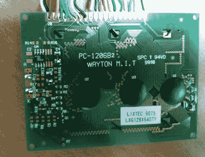

# 通过 LCD 嗅探从旧设备导出数据

> 原文：<https://hackaday.com/2022/05/05/exporting-data-from-old-gear-through-lcd-sniffing/>

[Jure Spiler]在跳蚤市场买了一台分光光度计——一种测量不同波长光的吸收率和透射率的设备。这种特殊的型号似乎有 25 年了，它由内置键盘控制，并使用图形液晶显示器显示收集的数据。这在制作时可能是可以接受的，但对[Jure]来说还不够。由于他想绘制分光光度数据并将其保存到 CSV 文件中，黑客攻击随之而来。

他决定接入显示器的通信线路。这款 128×64 图形显示器 PC-1206B 使用 8 位接口，因此借助 16 通道逻辑分析仪，他可以看到数据被发送到显示器。他甚至编写了[解码器软件](https://www.dropbox.com/s/4y97ssx9obc1wv0/_LCD_Reader_Hackaday.zip?dl=0)——从逻辑分析仪中获取 CSV 文件，并在解码的像素上使用原始的光学识别来确定显示的数字，并绘制出漂亮的波长吸光度图。从那时起，他开始制造一个独立的设备来嗅探数据总线，并创建一个可以发送到计算机进行存储和处理的数据流。

【Jure】然而，当他试图使用 Arduino 完成这项任务时，却遇到了路障。即使使用加速的 GPIO 库(相对于[出了名的低效](https://hackaday.com/2015/07/28/embed-with-elliot-there-is-no-arduino-language/) `digitalRead`)，他也无法获得高于 80 KHz 的读出频率——所需的 IO 读出速率被认为是 1 MHz，这将需要其他东西。我们确实想知道像 RP2040 这样的带有 PIO 机械装置的机器人是否会更好地进行这种捕捉。

然而，在这一点上，他发现分光光度计扩展端口的一个引脚上有未记录的串行输出，目前正在调查，搁置了 LCD 嗅探方向。然而，这为我们提供了另一个例子，在那些时候，我们只能使用 LCD 连接。

我们已经看到黑客嗅探 LCD 接口以从回流炉中获取数据，[从游戏男孩](https://hackaday.com/2017/08/01/using-a-logic-analyzer-to-generate-screenshots-from-a-game-boy/)那里获取截图，甚至[之后为他们配备 HDMI 和 VGA 端口](https://hackaday.com/2021/10/15/fpga-boards-add-vga-and-hmdi-interfaces-to-the-original-game-boy/)。有了这样的技能，你甚至可以让[这个显示屏已经损坏的老式计算器](https://hackaday.com/2020/03/08/bus-sniffing-leads-to-new-display-for-vintage-casio/)重获新生！有一个配备 LCD 的设备，但不确定它使用哪个特定的控制器？我们已经讨论过了！

 [https://www.youtube.com/embed/hW0DCHXE-gQ?version=3&rel=1&showsearch=0&showinfo=1&iv_load_policy=1&fs=1&hl=en-US&autohide=2&wmode=transparent](https://www.youtube.com/embed/hW0DCHXE-gQ?version=3&rel=1&showsearch=0&showinfo=1&iv_load_policy=1&fs=1&hl=en-US&autohide=2&wmode=transparent)

