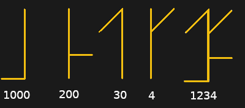

# 像公元 1234 年这样的数字

> 原文：<https://hackaday.com/2022/05/10/number-like-its-1234-ad-with-this-cistercian-keypad/>

如果你不知道西多会数字是什么，不要难过。除非你是西多会修道士，否则你真的没有理由学习追溯到 13 世纪的密码。但是话说回来，没有理由不使用数字系统来制作这个中世纪风格的电脑数字键盘。

如果你没有被介绍过西多会的数字系统，它实际上是相当聪明的。它有几种形式，但是[陶诺·埃里克]在这里使用的垂直形式是基于一个垂直的五线谱，上面有九个符号可以附着在它上面或与之相邻。每个字形代表九个数字中的一个——只有一到九；不需要零字形。五线谱周围有四个象限——右上、左上、右下和左下——字形所在的位置决定了字形的倍数。所以，如果你想写数字“1234”，你可以把下面的符号叠加成一个符号，如图所示。

[陶诺]的西多会键盘，不可否认地更像是一件艺术和历史作品，而不是一个有用的外围设备，不知何故看起来像是在[约克的狄奥多里克，中世纪会计师]的桌子上。它的外壳是激光切割的桦木胶合板，包含用于 20 个键盘开关的定制 PCB 和运行该节目的小 RP2040 MCU。键帽是由看起来像橡木的东西结合 3D 打印的部分定制的，类似于[他以前的木制键帽宏垫](https://hackaday.com/2021/05/21/custom-macro-keyboard-looks-good-in-wood/)。九个西多会象形文字中的每一个都是手工雕刻在键帽上的，加上一个虚构的零象形文字，这不是系统的一部分，以及可能让中世纪僧侣感到困惑的运算符和符号。

原生的西多会系统仅限于 1 到 9，999 之间的数字，所以我们猜测键盘只是输出与按下的西多会键相对应的阿拉伯数字，而不是真正组成完整的西多会数字。但是这样做的代码会很容易，结果也很酷，尽管对用户来说有点混乱。即使只是为了看起来，这仍然是一个很酷的项目，为了这个我们脱下了僧侣袍的兜帽。