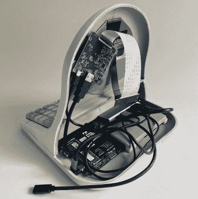

# 框架板得到这一轮显示电脑滚动

> 原文：<https://hackaday.com/2022/05/10/framework-board-gets-this-round-display-pc-rolling/>

对于我们这样的人来说，框架笔记本电脑已经是一个非常令人兴奋的前景——一台我们可以在制造商的许可下实际定制、升级和维修的高端计算机？我们听起来像音乐。但我们也非常兴奋地看到社区如何将框架的模块化组件应用到笔记本电脑之外的服务中。

一个很好的例子，这台[由【Penk Chen】](https://github.com/penk/MainboardTerminal)打造的绝对华丽的复古风格电脑。*主板终端*将一个框架主板、五英寸 1080 x 1080 圆形 LCD 显示屏和 OLKB Preonic 机械键盘结合到一个光滑的 3D 打印外壳中，该外壳用磁铁固定在一起以便于访问。与我们通常在这样的定制计算机版本中找到的 Raspberry Pi 相比，框架板提供了令人难以置信的性能，更不用说运行 x86 操作系统和软件的能力了。

 【彭克】现在已经加载了 Ubuntu 22.04 LTS，他报告说一切都像预期的那样工作，尽管你需要运行几个`xrandr`命令才能让系统与圆形显示屏正常工作。标准的 Ubuntu UI 看起来并不特别适合这样一个不寻常的视窗，但我们认为当你尝试这样一个古怪的屏幕时，这是一个你必须学会忍受的问题。

就在几周前，我们告诉你 [Framework 正在发布他们的主板模块](https://hackaday.com/2022/04/21/modular-laptop-maker-provides-mainboard-documentation-for-non-laptop-projects/)的机械图纸，我们当时预测这对那些制造定制计算机的人来说将是一个巨大的福音。说实话，我们预计某种类型的 cyberdeck 将是第一个进入我们收件箱的产品，但你肯定不会听到我们抱怨[看到更多仿古董个人终端](https://hackaday.com/2021/01/11/retro-terminals-bring-some-style-to-your-desktop/)。