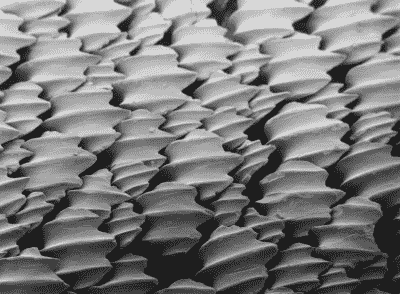
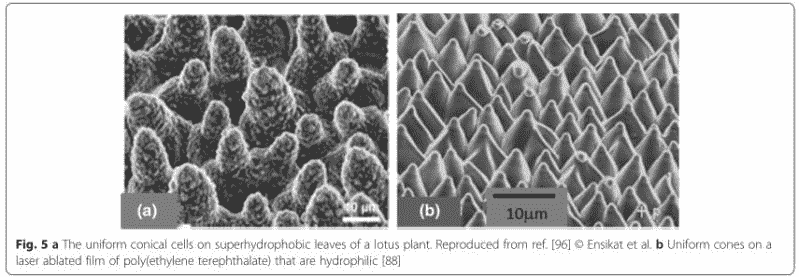
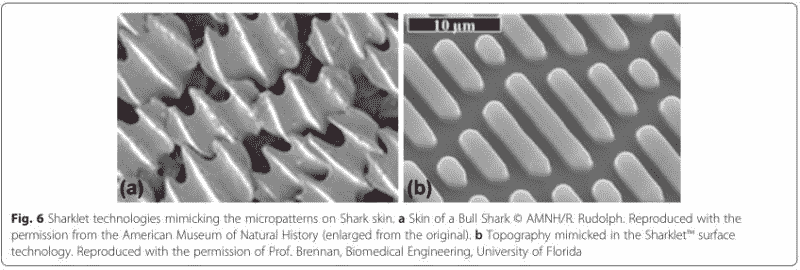

# 仿生表面:复制自然以阻止细菌并保持船体光滑

> 原文：<https://hackaday.com/2022/07/26/biomimetic-surfaces-copying-nature-to-deter-bacteria-and-keep-ship-hulls-smooth/>

你可能不认为保持船体在水中光滑与保持手术刀清洁有任何共同之处，但事实确实如此:在这两种情况下，你都在试图阻止自然——藤壶或生物膜——在表面上生长。科学观察了自然，发现由某些鲨鱼的鳞片或莲属植物的叶子形成的微图案展示了一种非常优雅的防止生物污损的方法，我们可以复制这种方法。

在海洋生物附着并生长在船体上的情况下，主要问题是阻力增加。这增加了燃料的使用，降低了容器的整体效率，需要定期清洗以清除这些生物污垢。在医院的背景下，这一层的增长变得更加重要。尽管使用了一次性导管和无菌包装，每年仍有大量的医院病人遭受感染。

## 生物膜形成

[生物膜](https://en.wikipedia.org/wiki/Biofilm)的形成可以追溯到[原核](https://en.wikipedia.org/wiki/Prokaryote)生命的最早期，以[叠层石](https://en.wikipedia.org/wiki/Stromatolite)的形式出现的化石证据就是证明。这些生物膜的核心似乎是一种防御机制，原核生物最初进化来应对恶劣环境，同时允许繁荣的原核生物群落的形成。这些群体也能让更复杂的生命形式生长。

随着时间的推移，真核生物[会采取类似的策略](https://en.wikipedia.org/wiki/Phototrophic_biofilms)，在最初附着于表面后，会产生细胞外基质。这些生物胶和结构为生物体提供保护，防止脱水和捕食，以及其他潜在的有害影响。

在海洋环境中，这些生物膜不仅为多细胞生物提供了附着表面，还提供了相伴的生态系统。例如，在藤壶的情况下，当幼年藤壶鲤科动物[转变到其静止的成年状态](https://www.nature.com/articles/s41598-019-54294-9)时，生物膜的存在和类型在特定附着位点的选择中至关重要。在其他海洋物种中也观察到了类似的模式，其结果是船体上的生态系统蓬勃发展，尽管这不是人们所希望的。

由于生物膜的形成在细菌和近亲存在的情况下只需要一些痕量的水分，这使得在医疗设备的制造或使用过程中表面可能被生物膜污染。生物膜允许细菌和其他病原体在表面存活较长时间，因此卫生方面的失误形成了重大的风险载体。

这种生物膜的确切危害取决于其内部的确切细菌和其他居住者，以及这种生物膜的位置。当 [MRSA](https://en.wikipedia.org/wiki/Methicillin-resistant_Staphylococcus_aureus) 细菌找到进入插管或静脉注射管的途径时，这可以为这些病原体提供直接进入患者体内的途径，在整个管道内部形成生物膜。一旦进入体内，它们就会开始形成生物膜，这是它们抵御患者免疫系统和抗生素等威胁的保护策略的一部分。

因此，最佳策略是首先防止这些生物膜的形成，理想的是通过防止最初的表面定殖。

## 你不应该依附

Placoid scales as viewed through an electron microscope. Also called dermal denticles, these are structurally homologous with vertebrate teeth.

关于进化的一个有趣的方面是，它寻求解决许多我们今天寻求解决的同样的问题。对于海洋动物来说，皮肤上有生物膜和其他生长物显然是有问题的，因为对它们来说，这意味着阻力的增加，就像船一样。这意味着动物在游泳时将消耗更多的能量，此外，由于如此多的细菌的接近，还可能导致皮肤和其他疾病的发生。

许多海洋动物摩擦岩石，与[清洁皮肤的鱼类物种](https://en.wikipedia.org/wiki/Remora)有共生关系，或者采用与我们陆地物种相同的皮肤脱落和更换过程。然而，最令人感兴趣的方法涉及微图案化，这使得形成生物膜的最初定殖步骤基本上不可能。

虽然鳞片在海洋和其他动物中很常见，但鲨鱼和鳐鱼的鳞片在微观形态上是独特的。在实验测试中显示明显缺乏生物膜形成。这是 [Damodaran 等人(2016)](https://www.researchgate.net/publication/303904711_Bio-inspired_strategies_for_designing_antifouling_biomaterials) 在*生物材料研究*中描述的防污方法之一。它总结了以下方法:

1.  *生物分子:*
    1.  一氧化氮释放剂。
    2.  肽和类肽修饰的表面。
2.  *表面的化学改性:*
    1.  亲水聚合物。
    2.  PEG 的固定化。
    3.  两性离子聚合物。
    4.  疏水性聚合物。
3.  *表面微图案化:*
    1.  莲花效应。
    2.  鲨鱼皮图案。

就我们可以从自然界复制什么而言，生物分子和表面修饰方法面临着高成本、有限的寿命和有限的适用性(就它们影响的细菌类型而言)。疏水性聚合物面临毒性问题。

Sourced from Damodaran et al. (2016).

这就剩下微图案了。这些微图案不是必须合成和定期应用的物质，而是可以蚀刻到表面上，效果的持续时间取决于蚀刻图案的材料的耐久性。也有可能使用自组装图案，例如在含有纳米粒子的涂料中。

Sourced from Damodaran et al. (2016).

对于船体应用，鲨鱼的[盾形鳞片](https://en.wikipedia.org/wiki/Fish_scale#Placoid_scales)特别有趣。它们似乎不仅可以防止细菌附着，还可以通过扰乱皮肤附近的层流来减少阻力。这种减阻很可能是这些真皮小齿发展过程中的一个相关进化因素，它也提供了这种防污类型的一个有趣方面——微图案可以减少船体在“干净”船体上的阻力。

## 扩大规模

与许多这样的防污技术一样，主要问题是使其规模达到经济上可行的水平，并使其持久。在这个时候，莲花效应是最常用的，因为它有规律的重复图案非常适合用于从屋顶瓦片和织物到油漆的任何东西。自清洁表面在户外环境中的应用是不言而喻的，因为这可以防止藻类和地衣的堆积，还可以防止涂鸦之类的事情。

鲨鱼皮样的图案有些复杂，因为它涉及到一个更复杂的图案，不容易自我组装。这项技术最著名的商业化版本可能是 Sharklet Technologies 出售的 [*Sharklet*](https://en.wikipedia.org/wiki/Sharklet_(material)) 材料及其获得专利的微图案。他们的产品主要针对医院和类似的环境，一系列研究也显示了他们在[预防神经植入物异物反应](https://www.ncbi.nlm.nih.gov/pmc/articles/PMC8059778/?report=classic)方面的有效性。

船壳和医用管道还不能做到的一件事是像鲨鱼皮那样长出皮肤小齿。鲨鱼不断刷新它的皮肤表面。很可能仍然需要多种方法的组合来对抗生物污垢，尽管我们很可能会看到微图案化在未来更普遍地被采用，以实现一个更清洁、更安全、更少拖累的世界。